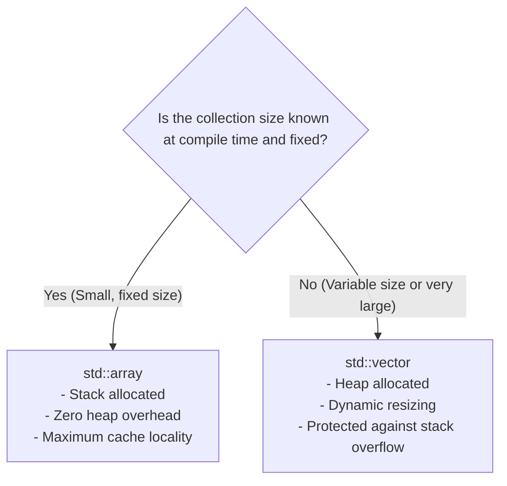

# std::array vs. std::vector in C++

## Overview

In C++, both `std::array` and `std::vector` provide contiguous memory storage for sequential collections of objects. However, their memory allocation strategies, sizing constraints, and runtime performance characteristics differ fundamentally:

- **`std::array`:** A thin, zero-overhead wrapper over a fixed-size, stack-allocated C-style array whose size is fixed at compile time.
- **`std::vector`:** A dynamically resizable array that manages a contiguous memory buffer on the heap.



---

## 1. Core Technical Differences

| Feature | `std::array<T, N>` | `std::vector<T>` |
|---|---|---|
| **Sizing Model** | Fixed at compile time ($N$ is a template parameter) | Dynamic; grows and shrinks at runtime |
| **Declaration** | `std::array<T, N>` (Requires size $N$) | `std::vector<T>` (Size optional at declaration) |
| **Memory Region** | Directly in the enclosing scope (usually **Stack**) | Elements on the **Heap**; $24$-byte control block on **Stack** |
| **Heap Overhead** | **Zero** dynamic memory allocation | Incurs heap allocation and reallocation costs |
| **Object Size (`sizeof`)** | $\text{sizeof}(T) \times N$ bytes | Fixed $3$ pointers ($24$ bytes on 64-bit systems) |
| **Resizing Capabilities** | None (immutable capacity and size) | Full dynamic API (`push_back`, `emplace_back`, `resize`, `clear`) |
| **Cache Performance** | Optimal (direct stack locality) | High (contiguous heap buffer), but requires 1 pointer dereference |

---

## 2. Memory Layout Architecture

### `std::array<int, 4> a = {10, 20, 30, 40};`

An `std::array` stores its elements inline, directly within the memory frame where it is instantiated:

```text
Stack Frame:
+--------+--------+--------+--------+
|  a[0]  |  a[1]  |  a[2]  |  a[3]  |
|   10   |   20   |   30   |   40   |
+--------+--------+--------+--------+
```

---

### `std::vector<int> v = {10, 20, 30, 40};`

A `std::vector` object consists of three pointers stored on the stack that manage a dynamically allocated memory buffer on the heap:
1. `_M_start` (Pointer to first element)
2. `_M_finish` (Pointer to one past the last active element)
3. `_M_end_of_storage` (Pointer to the end of the allocated heap capacity)

```text
Stack Frame (24 bytes on 64-bit):
+--------------+---------------+---------------------+
|  begin_ptr   |    end_ptr    |    capacity_ptr     |
+--------------+---------------+---------------------+
       |
       v  (Pointer to Heap)
Heap Buffer:
+--------+--------+--------+--------+---------------------+
|  v[0]  |  v[1]  |  v[2]  |  v[3]  |  (Unused capacity)  |
|   10   |   20   |   30   |   40   |  ...                |
+--------+--------+--------+--------+---------------------+
|<------- size = 4 --------------->|
|<------- capacity --------------->|
```

---

## 3. Code Comparison & Usage

```cpp
#include <iostream>
#include <array>
#include <vector>

void demonstrate() {
    // 1. std::array: Size must be a compile-time constant expression
    constexpr size_t N = 3;
    std::array<int, N> arr = {10, 20, 30};

    // arr.push_back(40); // COMPILE ERROR: std::array has fixed capacity
    std::cout << "std::array size:  " << arr.size() << '\n';
    std::cout << "std::array bytes: " << sizeof(arr) << " bytes\n"; // 3 * 4 = 12 bytes

    // 2. std::vector: Size can be determined dynamically at runtime
    int dynamic_size;
    std::cout << "Enter dynamic size: ";
    if (std::cin >> dynamic_size) {
        std::vector<int> vec(dynamic_size, 0);
        vec.push_back(40); // Dynamically expands heap buffer

        std::cout << "std::vector elements: " << vec.size() << '\n';
        std::cout << "std::vector stack obj: " << sizeof(vec) << " bytes\n"; // 24 bytes
    }
}
```

---

## 4. Decision Guidelines: When to Use Which

### Choose `std::array` When:
- The number of elements is **small, fixed, and known at compile time** (e.g., 3D/4D vectors, RGB color channels, days of the week, fixed lookup tables).
- You require **maximum execution speed** and zero memory allocation overhead.
- You want to eliminate heap fragmentation and enforce strict stack allocation.

### Choose `std::vector` When:
- The number of elements is **determined at runtime** (e.g., loaded from user input, files, or network streams).
- The collection must **grow or shrink dynamically** during execution.
- The dataset is **large** (e.g., thousands or millions of elements), where allocating on the stack would trigger a **Stack Overflow**.

