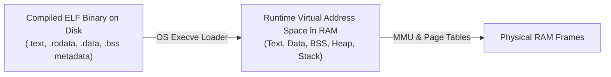
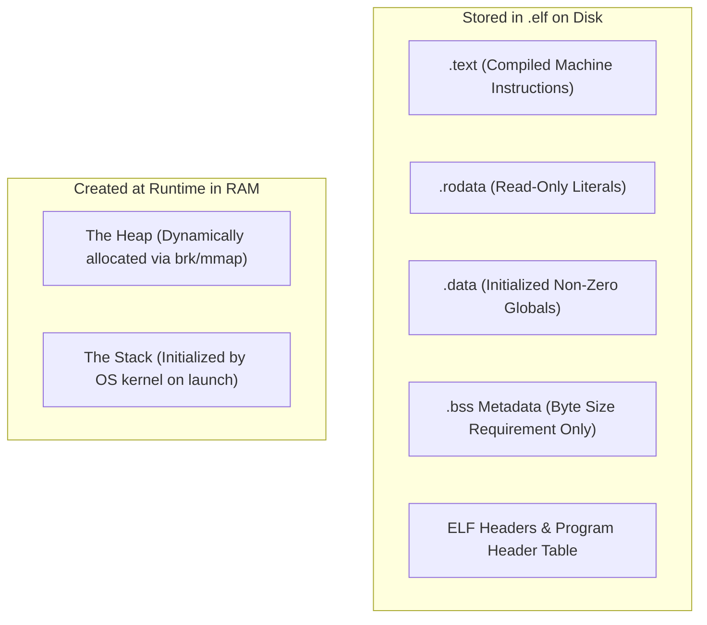
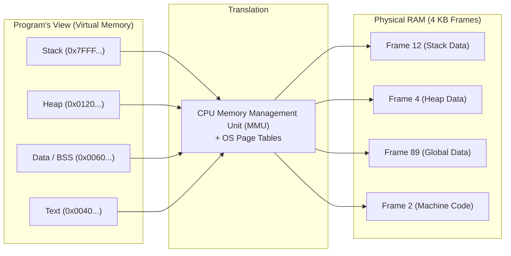
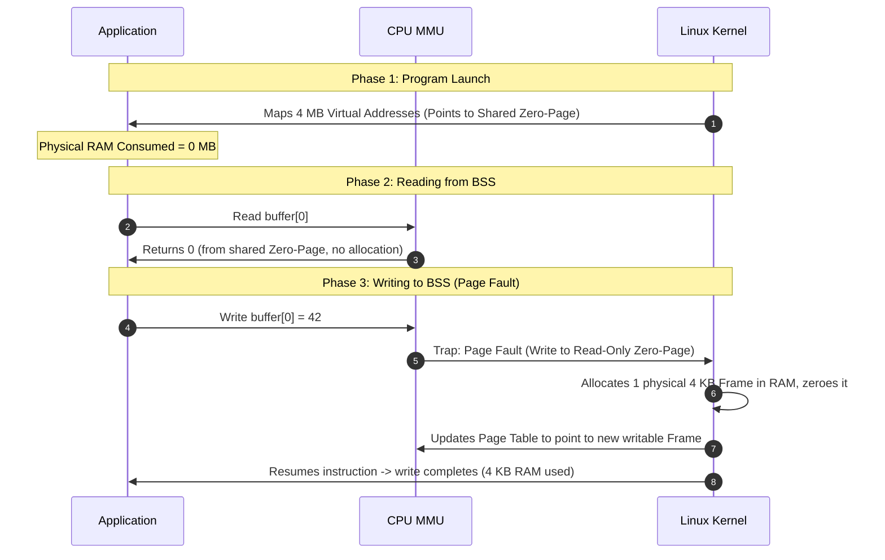

# ELF Binaries, RAM Allocation & Virtual Memory

## Overview

When you compile a C++ program on Linux, the compiler and linker generate a binary in **ELF (Executable and Linkable Format)**. 

This guide explains:
1. **ELF File on Disk vs. Process in RAM:** What data is physically stored in the compiled binary file on disk versus what only exists at runtime in RAM.
2. **The Architecture of Virtual Memory:** Why operating systems use virtual address spaces, page tables, and hardware Memory Management Units (MMUs).
3. **Lazy Allocation of the BSS Segment:** The Zero-Page optimization and on-demand Copy-on-Write page faults.
4. **Binary Inspection Tools:** Using `readelf`, `size`, and `objdump` to examine compiled binaries.



---

## 1. What is Stored on Disk vs. What Exists Only in RAM

An ELF binary contains the **blueprint** and **static data** of a program, but dynamic runtime structures exist only in RAM during process execution.



### 1. Stored in the `.elf` File on Disk

- **`.text` (Code Segment):** Contains the exact binary machine instructions generated by the compiler. Stored byte-for-byte.
- **`.rodata` (Read-Only Data):** Contains constant literals (e.g., `"Hello, World\n"`). Stored byte-for-byte.
- **`.data` (Initialized Globals):** Contains global and static variables initialized with non-zero values. Stored byte-for-byte.
- **`.bss` Metadata:** The actual values are **not** stored on disk. The ELF binary only records the byte size required (e.g., "allocate $4\text{ MB}$").
- **ELF Headers & Program Header Table:** Metadata instructing the OS kernel loader:
  - Which virtual addresses each segment must map to.
  - Access permissions for each segment (`R-X` for text, `RW-` for data/bss).
  - The entry point memory address (typically `_start`).

---

### 2. NOT Stored in the `.elf` File (Runtime RAM Only)

- **The Stack:** Created dynamically by the operating system kernel when the process launches. The kernel maps stack memory pages and initializes the CPU Stack Pointer (SP) register.
- **The Heap:** Starts empty upon launch. It is expanded dynamically at runtime by the memory allocator requesting memory pages from the kernel via system calls (`brk` or `mmap`).

---

### Comparison: Disk vs. RAM

| Memory Segment | Stored in `.elf` on Disk? | Allocated in RAM at Runtime? | Initial Access Permissions |
|---|:---:|:---:|:---:|
| **`.text`** | **Yes** (Exact machine code) | **Yes** (Mapped from disk) | Read-Only / Executable (`R-X`) |
| **`.rodata`** | **Yes** (Exact string literals) | **Yes** (Mapped from disk) | Read-Only (`R--`) |
| **`.data`** | **Yes** (Initial non-zero values) | **Yes** (Copied into writable RAM) | Read / Write (`RW-`) |
| **`.bss`** | **No** (Only size recorded) | **Yes** (Allocated and zeroed by OS) | Read / Write (`RW-`) |
| **Heap** | **No** | **Yes** (Grows via `brk`/`mmap`) | Read / Write (`RW-`) |
| **Stack** | **No** | **Yes** (Initialized by OS kernel) | Read / Write (`RW-`) |

---

### Inspecting ELF Binaries on Linux

You can inspect sections directly using Linux command-line utilities:

```bash
# Display section headers, sizes, and memory offsets:
readelf -S your_program

# Print summary sizes of text, data, and bss segments:
size your_program

# Disassemble the .text machine code instructions:
objdump -d -M intel your_program
```

---

## 2. The Need for Virtual Address Spaces

User-space applications **never interact with physical RAM addresses directly**. Every process operates inside a private, isolated **virtual address space** maintained by the OS and CPU hardware.

### Why Not Use Physical RAM Directly?
1. **Process Isolation & Security:** Direct physical access would allow a buggy or malicious program to overwrite the memory of other processes or read OS kernel secrets.
2. **Address Conflicts & Relocation:** If two programs were hardcoded to start at physical address `0x00400000`, they could not execute simultaneously.
3. **Memory Fragmentation:** Physical allocations would need to be contiguous, leading to severe external fragmentation.

---

### How Virtual Memory Works



- **Pages and Frames:** Virtual memory is divided into fixed-size chunks called **pages** (typically $4\text{ KB}$), while physical RAM is divided into matching **frames**.
- **Page Tables:** The OS maintains a multi-level lookup table mapping virtual pages to physical frames.
- **Hardware Translation (MMU):** The **Memory Management Unit (MMU)** on the CPU translates every virtual memory address into a physical address on the fly.
- **Non-Contiguous Physical Layout:** A large, contiguous virtual array can be mapped to physical frames scattered arbitrarily across physical RAM.
- **Unmapped Virtual Memory Costs Zero RAM:** The vast empty space between the heap and the stack consumes no physical RAM until touched.

---

## 3. How the OS Allocates the BSS Segment (Lazy Allocation)

When a program defines a large uninitialized global array, the OS **does not immediately allocate physical RAM**. Physical memory is allocated **lazily on demand**, one $4\text{ KB}$ page at a time.

```cpp
int buffer[1024 * 1024]; // 4 MB uninitialized global array (in .bss)
```



### Step-by-Step Mechanism

1. **Step 1: Program Launch (Virtual Allocation Only):**
   The OS kernel notes from the ELF header that BSS requires $4\text{ MB}$ starting at virtual address `0x601000`. It registers these virtual pages in the process page table. **$0\text{ MB}$ of physical RAM is consumed.**

2. **Step 2: The Zero-Page Optimization (Reading):**
   If the program reads from `buffer[i]`, the MMU maps the virtual page to a single, system-wide, read-only physical frame filled with zeros (the **Zero Page**). Reading consumes zero extra RAM.

3. **Step 3: Copy-on-Write via Page Faults (Writing):**
   When the program writes `buffer[0] = 42`:
   - The CPU detects a write to a read-only page and triggers a hardware interrupt called a **Page Fault**.
   - The OS kernel pauses the process, allocates an actual $4\text{ KB}$ physical RAM frame, zeroes it out, updates the page table entry to mark it writable, and resumes the program.
   - The write completes seamlessly.

---

## 4. Key Takeaways

1. **ELF Stores Structure, Not Stack/Heap:** The compiled `.elf` binary contains code (`.text`) and initialized data (`.data`), but stack and heap exist strictly as dynamic runtime constructs in RAM.
2. **Virtual Memory Provides Isolation & Efficiency:** Virtual address spaces eliminate physical address conflicts, provide memory protection, and enable non-contiguous physical storage.
3. **Lazy Allocation Minimizes Footprint:** BSS and dynamic heap allocations consume physical RAM only when pages are written to, using zero-page mapping and page faults to conserve system memory.

