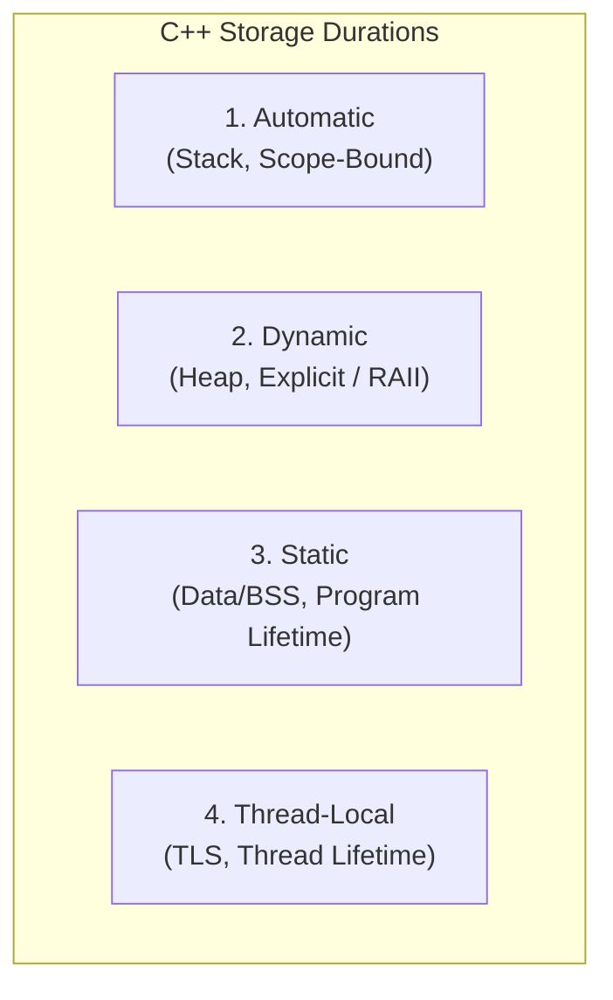
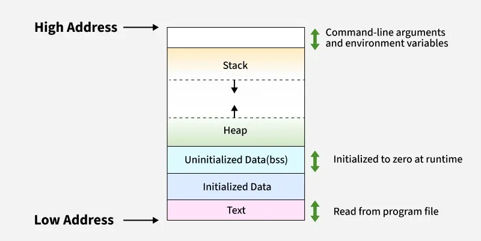
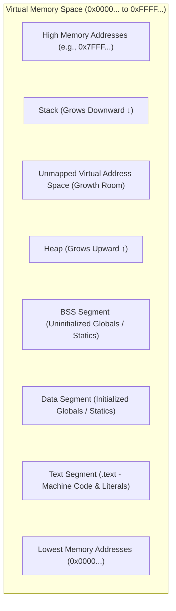

# C++ Memory Allocations & Program Memory Layout

## Overview

In C++, memory management and object lifetimes are governed by **storage duration** and the architectural **memory segments** allocated by the operating system.

This guide provides a comprehensive breakdown of:
1. **The Four Storage Durations:** Automatic (Stack), Dynamic (Heap), Static (Data/BSS), and Thread-Local (TLS).
2. **Virtual Memory Layout of a Process:** The Text, Initialized Data, BSS, Heap, and Stack segments.
3. **Hardware Execution & Allocation Costs:** How stack pointers, heap allocators, and memory segments interact at the machine level.



---

## 1. The Four Storage Durations in C++

Every variable in C++ has a storage duration that determines its lifetime, its location in memory, and how it is initialized and deallocated.

### 1. Automatic Storage Duration (Stack Allocation)

- **Memory Region:** The **Stack**.
- **Allocation & Lifetime:** Allocated automatically when execution enters the enclosing block or function scope, and deallocated automatically in reverse order of creation when the scope exits.
- **Performance:** Near-instantaneous allocation and deallocation (advancing/retracting the CPU Stack Pointer register).
- **Limitations:** Stack size is limited (typically $1\text{ to }8\text{ MB}$ by default). Allocating massive arrays on the stack causes a **Stack Overflow**.

```cpp
#include <array>

void process() {
    int a = 10;                  // Allocated on stack frame
    std::array<int, 100> buffer; // 400 bytes allocated directly on the stack
} // 'a' and 'buffer' are automatically deallocated when exiting scope
```

---

### 2. Dynamic Storage Duration (Heap / Free Store Allocation)

- **Memory Region:** The **Heap** (Free Store).
- **Allocation & Lifetime:** Explicitly requested at runtime using `new` / `new[]` (or `malloc` in C) and persists until explicitly freed with `delete` / `delete[]` (or `free`), or managed automatically via RAII smart pointers and containers (`std::vector`, `std::unique_ptr`).
- **Performance:** Slower than stack allocation because the allocator must search free lists for an appropriately sized chunk and manage heap fragmentation.
- **Capacity:** Bounded only by the system's available virtual memory.

```cpp
#include <memory>
#include <vector>

void process() {
    // Manual dynamic allocation (must be paired with delete):
    int* ptr = new int(42);
    delete ptr;

    // Idiomatic Modern C++ (RAII):
    auto smart_ptr = std::make_unique<int>(42); // Automatically freed on scope exit
    std::vector<int> vec = {1, 2, 3};           // Elements reside on the heap
}
```

---

### 3. Static Storage Duration (Data & BSS Segments)

- **Memory Region:** The **Data Segment** (initialized) or **BSS Segment** (uninitialized/zero-initialized).
- **Allocation & Lifetime:** Allocated once when the program is loaded into memory and remains allocated until the entire process terminates.
- **Scope:** Applies to global variables, file-scope static variables, class static members, and function-local `static` variables.

```cpp
int global_counter = 0; // Static storage duration (lives in .bss)
int global_seed = 1337; // Static storage duration (lives in .data)

void log_call() {
    // Initialized only on the first function entry; persists across calls:
    static int call_count = 0; 
    call_count++;
}
```

---

### 4. Thread-Local Storage Duration (TLS Segment)

- **Memory Region:** The **Thread-Local Storage (TLS)** segment.
- **Allocation & Lifetime:** Introduced in C++11 via the `thread_local` keyword. Allocated when a thread begins and destroyed when that specific thread terminates.
- **Isolation:** Each running thread receives its own independent copy of the variable, avoiding data races and eliminating synchronization mutex overhead.

```cpp
#include <thread>

// Each spawned thread gets its own private instance:
thread_local int thread_specific_id = 0; 
```

---

### Storage Duration Summary

| Storage Duration | Memory Region | Lifetime | Size Determined At | Allocation Overhead |
|---|---|---|:---:|---|
| **Automatic** | Stack | Enclosing block / scope | Compile time | Extremely low (pointer subtraction) |
| **Dynamic** | Heap | Explicit (`new` to `delete` / RAII) | Runtime | Moderate (allocator metadata & free list lookup) |
| **Static** | Data / BSS | Program startup to termination | Compile time | Zero runtime allocation cost |
| **Thread-Local** | TLS | Thread creation to exit | Compile time | Low (one-time thread initialization) |

---

## 2. Virtual Memory Layout of a Process

When an operating system executes a compiled C++ binary, it assigns the program an isolated, contiguous **virtual address space**. This address space is organized into standardized segments.





---

### 1. Text Segment (Code Segment)

- **Content:** The raw compiled machine instructions (CPU opcodes) and read-only literal constants (such as string literals `"Hello, World"`).
- **Access Permissions:** **Read-Only and Executable (`R-X`)**. The operating system blocks write operations to prevent self-modifying code and security exploits.
- **Size:** Fixed at load time based on the binary size.

---

### 2. Initialized Data Segment (`.data`)

- **Content:** Global and static variables that are explicitly initialized with a non-zero value at compile time.
- **Access Permissions:** **Read/Write (`RW-`)**.
- **Binary Footprint:** Stored byte-for-byte in the compiled executable file on disk.

```cpp
int global_max = 100;        // Lives in .data
static const char* msg = "OK"; // Pointer in .data, string literal in .rodata
```

---

### 3. Uninitialized Data Segment (`.bss`)

- **Name Origin:** Historical acronym for *Block Started by Symbol*.
- **Content:** Global and static variables that are uninitialized or explicitly initialized to zero.
- **Access Permissions:** **Read/Write (`RW-`)**.
- **Disk Optimization:** Does **not** consume space in the binary file on disk. The ELF binary only records the total byte size required. The OS kernel lazily allocates and zeroes out this memory upon program startup.

```cpp
int global_buffer[10000]; // Lives in .bss (Consumes 0 bytes on disk!)
static int active_connections = 0; // Initialized to zero -> Lives in .bss
```

---

### 4. The Heap (Free Store)

- **Content:** Memory dynamically allocated at runtime via `new`, `malloc`, or STL dynamic containers (`std::vector`, `std::string`, `std::unique_ptr`).
- **Growth Direction:** Typically expands **upward ($\uparrow$) toward higher memory addresses**.
- **Management:** Managed via runtime allocators (e.g., `ptmalloc`, `tcmalloc`, `jemalloc`) issuing kernel system calls (`brk` / `mmap`).

---

### 5. The Stack

- **Content:** Stores **Stack Frames (Activation Records)** created for each function call:
  - Local function variables.
  - Value parameters passed into the function.
  - The return address (where the CPU resumes execution after function exit).
  - Saved CPU register state.
- **Growth Direction:** On most modern architectures (x86-64, ARM), the stack expands **downward ($\downarrow$) toward lower memory addresses**.
- **Management:** Managed by hardware via the CPU **Stack Pointer (SP)** register.

---

### 6. Thread-Local Storage (TLS)

- **Content:** Variables declared with `thread_local`.
- **Management:** The runtime maintains an independent memory block for each active thread, indexed relative to a hardware Thread Pointer (TP) register.

---

## 3. Segment Characteristics Comparison

| Segment | Memory Location | Growth Direction | OS Permissions | In Executable on Disk? | Contents |
|---|---|:---:|:---:|:---:|---|
| **Stack** | High Virtual Memory | Downward ($\downarrow$) | Read / Write (`RW-`) | **No** (Allocated by OS at launch) | Local variables, function call frames |
| **Heap** | Mid Virtual Memory | Upward ($\uparrow$) | Read / Write (`RW-`) | **No** (Grows dynamically via `brk`/`mmap`) | Dynamic allocations (`new`, `malloc`, `std::vector`) |
| **BSS** | Low Virtual Memory | Fixed | Read / Write (`RW-`) | **No** (Only size recorded in header) | Uninitialized and zero-initialized globals/statics |
| **Data** | Low Virtual Memory | Fixed | Read / Write (`RW-`) | **Yes** (Exact values stored) | Initialized non-zero globals and statics |
| **Text** | Lowest Virtual Memory | Fixed | Read / Exec (`R-X`) | **Yes** (Exact machine instructions) | Compiled CPU instructions, constant literals |

---

## 4. Key Takeaways

1. **Stack vs. Heap Performance:** Stack allocation costs a single CPU register update ($O(1)$) but has strict size limits; Heap allocation allows arbitrary dynamic sizes but incurs allocator lookup and fragmentation overhead.
2. **Disk Efficiency via BSS:** Large zero-initialized arrays should be declared globally or statically to place them in `.bss`, keeping compiled binary files small.
3. **Segment Separation Protects Programs:** Memory segments isolate executable code from writable data, preventing accidental corruption and security vulnerabilities (e.g., buffer-overflow code injection).

