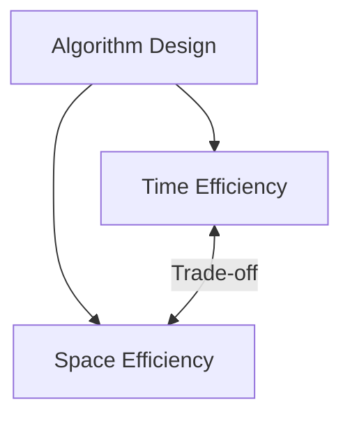
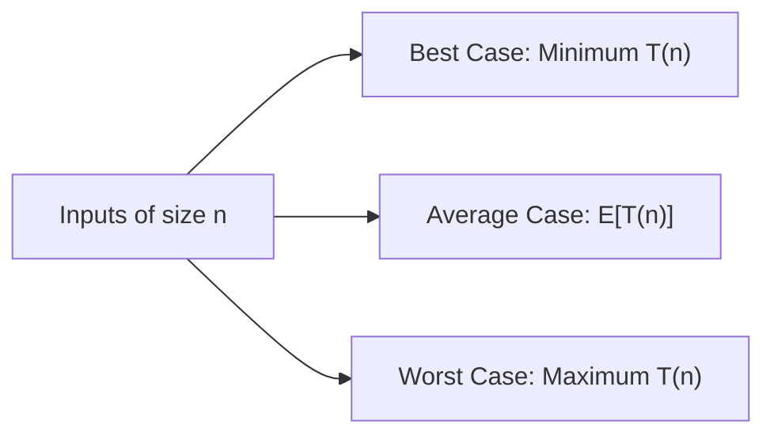
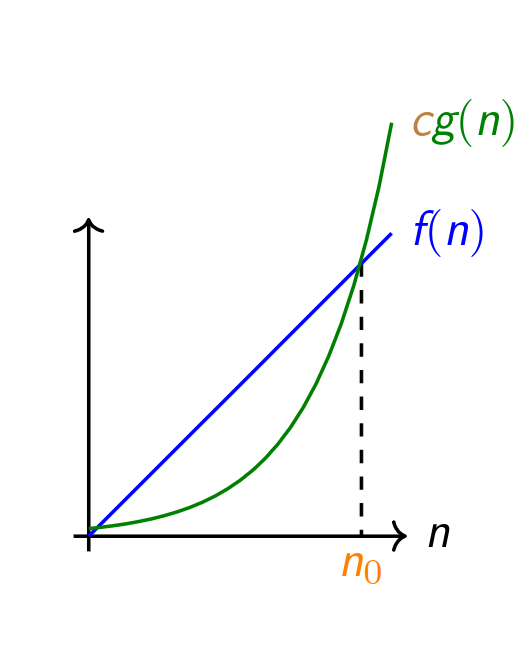
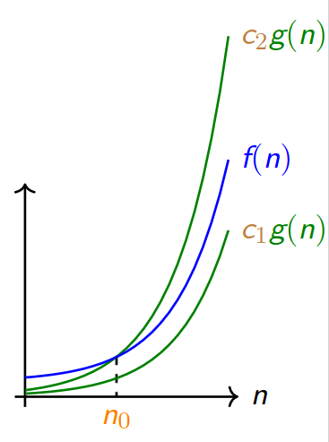

# Big-O Notation & Asymptotic Complexity

## 1. Motivation: Resource Consumption

When solving computational problems, algorithms consume two fundamental resources:
- **Time:** The duration or number of operations required to compute the output.
- **Space:** The amount of working memory required during execution.

There are often multiple algorithms capable of solving a given problem. Some algorithms are efficient, while others are inefficient.



> [!NOTE]
> **Time-Space Trade-off:** Sometimes there is an explicit trade-off between time and space. For example, Linear Search uses only one extra variable ($i$), while Binary Search requires three extra variables ($\text{first}$, $\text{last}$, $\text{mid}$). Although the difference of two integers is minor here, it demonstrates how extra memory can facilitate algorithmic speedups.

Measuring execution time in terms of exact machine instructions, hardware cycles, and clock frequencies is cumbersome and heavily dependent on specific machines and compilers. We require an **approximate, machine-independent** method to measure and compare algorithm efficiency.

---

## 2. Input Size

An algorithm's running time varies across different inputs. To enable meaningful comparisons, we express running time as a function of the **input size** ($n$), defined in terms of key input parameters.

### Example 1.8: Search Problem Input Size
In the search problem on an array $S$, the input size $n$ is the number of elements in the array.

> [!IMPORTANT]
> **Why do we not count individual bit lengths?**
> In theoretical analysis, the number of bits in the binary representation of the input represents the most precise size. However, this level of detail is cumbersome for everyday analysis. In typical algorithms, we assume elements fit into standard fixed-width machine words (e.g., $32$-bit integers drawn from a universe of size $2^{32}$). Because arithmetic and comparison operations on fixed-width words take constant $O(1)$ time, we treat the number of elements $n$ as the input size.

---

## 3. Best-Case, Worst-Case, and Average-Case Analysis

For a fixed input size $n$, the running time can vary dramatically depending on the specific values in the input. We distinguish three analytical cases:

1. **Best Case:** The shortest running time over all possible inputs of size $n$.
2. **Worst Case:** The longest running time over all possible inputs of size $n$.
3. **Average Case:** The expected (average) running time over all possible inputs of size $n$, weighted by their probability distribution.



### Exercise 1.7: Modifying Best-Case Running Time
**Question:** How can we modify almost any algorithm to have a good best-case running time?

**Answer:** We can insert a special-case check at the beginning of the algorithm:
```text
if input == special_hardcoded_input:
    return precomputed_answer
```
If the input matches this specific case, the algorithm terminates immediately in $O(1)$ time. Because best-case scenarios can be artificially engineered, **worst-case and average-case analyses provide much more reliable performance guarantees**.

---

### Example 1.9: Binary Search Case Analysis

Consider Binary Search on a sorted array $S$ of size $n = 2^k - 1$:

```cpp
int BinarySearch(int* S, int n, int e) {
    // S is a sorted array
    int first = 0, last = n;
    int mid = (first + last) / 2;
    while (first < last) {
        if (S[mid] == e) return mid;
        if (S[mid] > e) {
            last = mid;
        } else {
            first = mid + 1;
        }
        mid = (first + last) / 2;
    }
    return -1;
}
```

1. **Best Case:** The target element $e$ is located exactly at the initial midpoint ($e = S[\lfloor n/2 \rfloor]$). The loop terminates in the first iteration:
   
   $$\text{Time} = T_{\text{Read}} + 6 T_{\text{Arith}} + T_{\text{Return}}$$

2. **Worst Case:** The target element is not in the array ($e \notin S$) or requires traversing to a leaf in the decision tree. The loop executes $k = \log_2(n + 1)$ iterations.
3. **Average Case:** In a balanced binary search decision tree of size $n = 2^k - 1$:
   - Level $1$ (root) contains $1$ element ($1$ comparison).
   - Level $2$ contains $2$ elements ($2$ comparisons).
   - Level $d$ contains $2^{d-1}$ elements ($d$ comparisons).
   - Level $k$ (deepest) contains $2^{k-1} \approx \frac{n+1}{2}$ elements ($\approx 50\%$ of all elements), each requiring $k$ comparisons.
   
   Because the vast majority of elements reside at or near the deepest level, the expected number of comparisons is approximately $k - 1 \approx k$. Thus, **the average case is asymptotically identical to the worst case**.

> [!NOTE]
> Average-case analysis is generally mathematically involved and depends on an assumed probability distribution over the inputs.

---

## 4. Asymptotic and Machine-Independent Behavior

For small inputs, algorithmic overhead or hardware quirks may dominate. To compare algorithms rigorously and independent of hardware variations, we study their **asymptotic behavior**—how their resource consumption scales as the input size $n \to \infty$.

We apply two key simplifications:
1. **Drop Lower-Order Terms:** As $n$ grows large, higher-order terms dominate.
   $$100\,000\,000\,000\,001 \approx 100\,000\,000\,000\,000$$
2. **Ignore Constant Multiplicative Factors:** Machine-specific constants do not affect scalability.
   $$3k T_{\text{Arith}} \approx k$$

---

## 5. Big-O Notation: Asymptotic Upper Bound

Big-$O$ notation formalizes the concept of an asymptotic upper bound.

### Definition 1.3 (Big-O)
Let $f, g: \mathbb{N} \to \mathbb{R}^+$. We say $f(n) \in O(g(n))$ (or $f(n) = O(g(n))$) if there exist positive constants $c > 0$ and $n_0 \ge 0$ such that:

$$\forall n \ge n_0, \quad f(n) \le c \cdot g(n)$$

In words, for all sufficiently large $n \ge n_0$, the function $f(n)$ is bounded from above by $c \cdot g(n)$.



---

### Exercise 1.8: Evaluating Big-O Statements

Evaluate the validity of each statement and determine whether $f(n) \in O(g(n))$:

1. **$5n + 8 \in O(n)$ — True**
   - *Justification:* For all $n \ge 8$, $5n + 8 \le 5n + n = 6n$. Choose $c = 6$ and $n_0 = 8$.

2. **$5n + 8 \in O(n^2)$ — True**
   - *Justification:* For all $n \ge 1$, $5n + 8 \le 5n^2 + 8n^2 = 13n^2$. Choose $c = 13$ and $n_0 = 1$. Big-$O$ represents an upper bound and is not required to be tight.

3. **$5n^2 + 8 \in O(n)$ — False**
   - *Justification:* $\lim_{n \to \infty} \frac{5n^2 + 8}{n} = \lim_{n \to \infty} \left(5n + \frac{8}{n}\right) = \infty$. No constant $c$ can satisfy $5n^2 + 8 \le c n$ for all large $n$.

4. **$n^2 + n \in O(n^2)$ — True**
   - *Justification:* For all $n \ge 1$, $n^2 + n \le n^2 + n^2 = 2n^2$. Choose $c = 2$ and $n_0 = 1$.

5. **$5 \times 10^{23} n^2 \in O(n^2)$ — True**
   - *Justification:* Choose $c = 5 \times 10^{23}$ and $n_0 = 1$. Asymptotic notation ignores constant multiplicative factors regardless of magnitude.

6. **$50n^2 \log n + 60n^2 \in O(n^2 \log n)$ — True**
   - *Justification:* For all $n \ge 2$, $\log n \ge 1$, so $60n^2 \le 60n^2 \log n$. Thus, $50n^2 \log n + 60n^2 \le 110n^2 \log n$. Choose $c = 110$ and $n_0 = 2$.

---

## 6. Worst-Case Analysis of Binary Search in Big-O

### Example 1.10
In Binary Search on an array of size $n = 2^k - 1$, the exact worst-case running time was derived as:

$$T(n) = k T_{\text{Read}} + (6k + 5) T_{\text{Arith}} + (3k + 1) T_{\text{Jump}} + T_{\text{Return}}$$

Grouping the terms by $k$:

$$T(n) = (T_{\text{Read}} + 6 T_{\text{Arith}} + 3 T_{\text{Jump}}) k + (5 T_{\text{Arith}} + T_{\text{Jump}} + T_{\text{Return}})$$

Let $C_1 = T_{\text{Read}} + 6 T_{\text{Arith}} + 3 T_{\text{Jump}}$ and $C_2 = 5 T_{\text{Arith}} + T_{\text{Jump}} + T_{\text{Return}}$. For $k \ge 1$:

$$T(n) = C_1 k + C_2 \le (C_1 + C_2) k \implies T(n) \in O(k)$$

Since $n = 2^k - 1 \implies k = \log_2(n + 1)$, and $\log_2(n + 1) \le \log_2(2n) = \log_2 n + 1 \le 2 \log_2 n$ for all $n \ge 2$:

$$k \in O(\log n)$$

Therefore, **the worst-case running time of Binary Search is $O(\log n)$**.

---

## 7. Hierarchy of Complexity Classes

Big-$O$ expresses how the approximate number of operations scales with input size.

### Standard Complexity Classes

| Class Name | Notation | Example Algorithms |
|---|---|---|
| **Constant** | $O(1)$ | Array index lookup, push/pop on stack |
| **Logarithmic** | $O(\log n)$ | Binary Search |
| **Linear** | $O(n)$ | Linear Search, finding minimum |
| **Linearithmic / Quasilinear** | $O(n \log n)$ | Merge Sort, Heap Sort |
| **Quadratic** | $O(n^2)$ | Bubble Sort, Selection Sort |
| **Polynomial** | $O(n^k)$ (for constant $k$) | Matrix Multiplication ($O(n^{2.371\dots})$) |
| **Exponential** | $O(2^n)$ or $O(c^n)$ | Enumerating all subsets, recursive Fibonacci |
| **Factorial** | $O(n!)$ | Traveling Salesperson via brute force |

### Growth Ordering

$$O(1) < O(\log n) < O(n) < O(n \log n) < O(n^2) < O(n^k) < O(2^n) < O(n!)$$

> [!WARNING]
> **Constants Matter in Practice:** Big-$O$ notation deliberately suppresses constant factors. An $O(n)$ algorithm with a large constant ($10^9 n$) will run slower on practical inputs ($n < 10^9$) than an $O(n^2)$ algorithm with a unit constant ($1 \cdot n^2$).

### Exercise 1.10: Formal Definition of Asymptotic Growth Ordering
**Question:** Give the formal mathematical definition of the strict asymptotic ordering $f(n) < g(n)$ (also known as little-$o$ notation, $f(n) \in o(g(n))$).

**Answer:**
We say $f(n) \in o(g(n))$ if:

$$\lim_{n \to \infty} \frac{f(n)}{g(n)} = 0$$

Equivalently, for **every** real constant $c > 0$, there exists an integer $n_0 \ge 0$ such that:

$$\forall n \ge n_0, \quad f(n) < c \cdot g(n)$$

---

## 8. Complexity of an Algorithm vs. Complexity of a Problem

It is essential to distinguish between the complexity of a specific *algorithm* and the complexity of a *problem*.

- **Definition 1.4 (Algorithm Complexity):** The worst-case running time of an algorithm is defined as the complexity of the algorithm.
- **Definition 1.5 (Average-Case Complexity):** The expected running time of an algorithm over all inputs of size $n$.
- **Complexity of a Problem:** The complexity of the **best-known algorithm** that solves the problem.

### Exercise 1.11 & 1.12: Problem Complexity Misconceptions

1. **Sorting an Array:**
   - *Common Misconception:* "The complexity of sorting is $O(n^2)$."
   - *Correction:* This statement is incorrect because algorithms such as Merge Sort and Heap Sort solve sorting in $O(n \log n)$ time. Furthermore, $O(n \log n)$ is the proven information-theoretic lower bound for comparison-based sorting.
2. **Matrix Multiplication:**
   - *Common Misconception:* "The complexity of matrix multiplication is $O(n^3)$."
   - *Correction:* The naive nested-loop algorithm runs in $O(n^3)$, but Strassen's algorithm runs in $O(n^{2.807})$, and the current best-known theoretical algorithms achieve approximately $O(n^{2.371})$. Finding the true optimal bound remains an active open research problem.

---

## 9. $\Theta$-Notation (Tight Bound)

While Big-$O$ provides an asymptotic upper bound, $\Theta$-notation defines a **tight bound** that sandwiches the function from both above and below.

### Definition 1.6 ($\Theta$-Notation)
Let $f, g: \mathbb{N} \to \mathbb{R}^+$. We say $f(n) \in \Theta(g(n))$ (or $f(n) = \Theta(g(n))$) if there exist positive constants $c_1 > 0$, $c_2 > 0$, and an integer $n_0 \ge 0$ such that:

$$\forall n \ge n_0, \quad c_1 \cdot g(n) \le f(n) \le c_2 \cdot g(n)$$



> [!NOTE]
> A function $f(n) \in \Theta(g(n))$ if and only if $f(n) \in O(g(n))$ and $g(n) \in O(f(n))$ (i.e., $f(n) \in \Omega(g(n))$).

---

### Exercise 1.13: $\Theta$-Bound for Binary Search

**Question:**
a. Does the worst-case running time of Binary Search belong to $\Theta(\log n)$?
b. If yes, determine valid constants $c_1$, $c_2$, and $n_0$ satisfying Definition 1.6.

#### Solution:
a. **Yes**, the worst-case running time belongs to $\Theta(\log n)$.

b. **Deriving Constants $c_1, c_2, n_0$:**
From our machine-level cost model for $n = 2^k - 1$, the running time is:

$$f(n) = C_1 \log_2(n + 1) + C_2$$

where $C_1 = T_{\text{Read}} + 6 T_{\text{Arith}} + 3 T_{\text{Jump}} > 0$ and $C_2 = 5 T_{\text{Arith}} + T_{\text{Jump}} + T_{\text{Return}} > 0$.

1. **Lower Bound ($c_1$):**
   For all $n \ge 1$, $\log_2(n + 1) > \log_2(n)$ and $C_2 > 0$:
   
   $$f(n) = C_1 \log_2(n + 1) + C_2 > C_1 \log_2 n$$
   
   Therefore, we can set $c_1 = C_1$.

2. **Upper Bound ($c_2$):**
   For all $n \ge 2$, $n + 1 \le n^2$, so $\log_2(n + 1) \le 2 \log_2 n$. Also, since $\log_2 n \ge 1$, $C_2 \le C_2 \log_2 n$:
   
   $$f(n) \le C_1 (2 \log_2 n) + C_2 \log_2 n = (2C_1 + C_2) \log_2 n$$
   
   Therefore, we can set $c_2 = 2C_1 + C_2$.

3. **Threshold ($n_0$):**
   Setting $n_0 = 2$ ensures both bounds hold simultaneously:
   
   $$\forall n \ge 2, \quad C_1 \log_2 n \le f(n) \le (2C_1 + C_2) \log_2 n$$

This rigorously proves that the worst-case running time of Binary Search is $\Theta(\log n)$.

