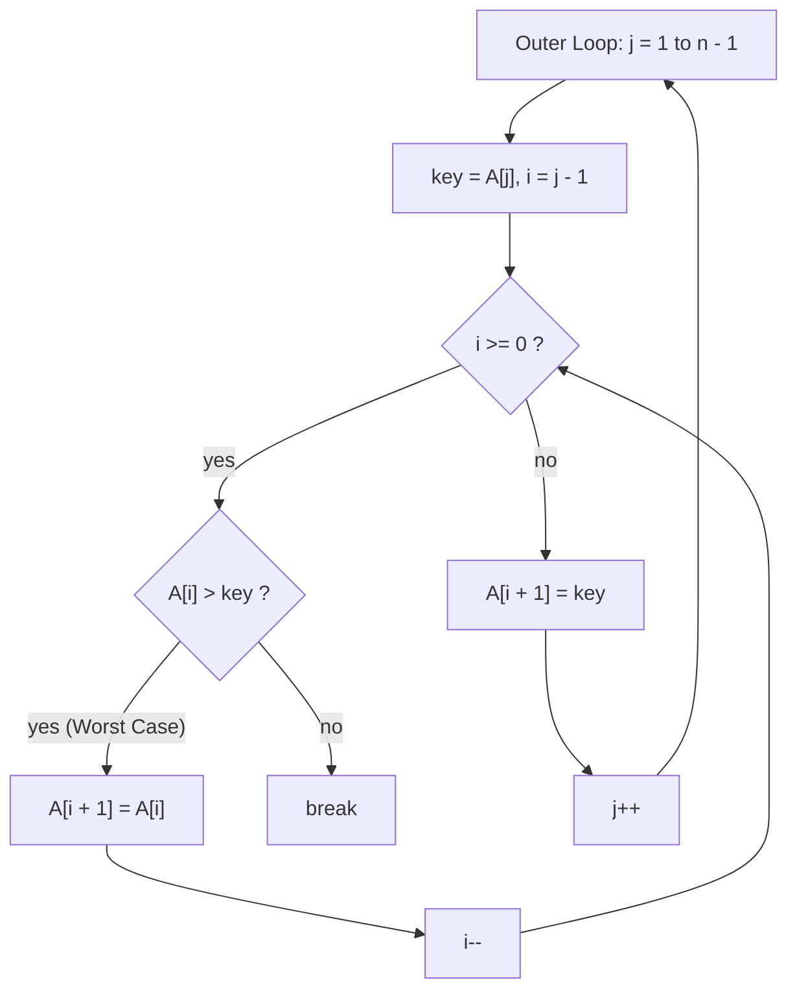

# Lecture 1.2: Exact Cost Analysis, Number Representations & Polynomial Growth

## Overview

This module focuses on applying analytical tools and asymptotic frameworks to concrete algorithms and mathematical models. We cover:
1. **Exact Instruction-Level Analysis of Insertion Sort:** Deriving exact operation counts using summations and proving its $\Theta(n^2)$ worst-case time.
2. **Computational Complexity of Arithmetic Operations:** Comparing binary vs. unary representations for addition and multiplication with respect to input length ($k$) and numeric value ($N$).
3. **Polynomial Growth and Asymptotic Dominance:** Formally proving that higher-degree polynomials asymptotically dominate lower-degree polynomials using limits and contradiction.

---

## 1. Exact Worst-Case Analysis of Insertion Sort (Exercise 1.14)

### Problem Statement
Given the C++ implementation of Insertion Sort below, compute the exact worst-case running time $T(n)$ as a function of the array size $n$ and the individual execution costs $c_k$ of each machine operation.

```cpp
for (int j = 1; j < n; j++) {
    int key = A[j];
    int i = j - 1;
    while (i >= 0) {
        if (A[i] > key) {
            A[i + 1] = A[i];
        } else {
            break;
        }
        i--;
    }
    A[i + 1] = key;
}
```



---

### Characterizing the Worst Case

The worst-case execution occurs when the input array $A$ is sorted in **strictly decreasing order**:

$$A[0] > A[1] > A[2] > \dots > A[n-1]$$

Under this condition:
- For every outer loop index $j$, the element $\text{key} = A[j]$ is strictly smaller than all preceding elements $A[0 \dots j-1]$.
- The condition `A[i] > key` evaluates to `true` for all $i \in \{j-1, j-2, \dots, 0\}$.
- The inner `while` loop iterates $j$ times, shifting elements rightward, and evaluates its condition one additional time when $i = -1$ to terminate.
- The `else { break; }` branch is never taken ($0$ executions).

---

### Line-by-Line Execution Counts

Let $c_k$ denote the constant cost of executing line $k$ once on a machine.

| Line | Statement | Cost | Worst-Case Execution Count |
|:---:|---|:---:|:---:|
| **1** | `for (int j = 1; j < n; j++)` | $c_1$ | $n$ |
| **2** | `int key = A[j];` | $c_2$ | $n - 1$ |
| **3** | `int i = j - 1;` | $c_3$ | $n - 1$ |
| **4** | `while (i >= 0)` | $c_4$ | $\sum_{j=1}^{n-1} (j + 1)$ |
| **5** | `if (A[i] > key)` | $c_5$ | $\sum_{j=1}^{n-1} j$ |
| **6** | `A[i + 1] = A[i];` | $c_6$ | $\sum_{j=1}^{n-1} j$ |
| **7–9** | `else { break; }` | $c_7$ | $0$ |
| **10** | `i--;` | $c_8$ | $\sum_{j=1}^{n-1} j$ |
| **12** | `A[i + 1] = key;` | $c_9$ | $n - 1$ |

> [!NOTE]
> Line 1 executes $n$ times: $n - 1$ times when $j < n$ is true ($j = 1, 2, \dots, n-1$), plus $1$ final check when $j = n$ to exit.

---

### Closed-Form Evaluation of Summations

Using standard arithmetic progression formulas:

1. **Inner Loop Body Executions:**
   
   $$\sum_{j=1}^{n-1} j = \frac{(n - 1)n}{2} = \frac{n^2 - n}{2}$$

2. **Inner Loop Condition Checks:**
   
   $$\sum_{j=1}^{n-1} (j + 1) = \sum_{j=1}^{n-1} j + \sum_{j=1}^{n-1} 1 = \frac{n^2 - n}{2} + (n - 1) = \frac{n^2 + n - 2}{2}$$

---

### Derivation of Total Running Time $T(n)$

Summing the cost products across all lines:

$$T(n) = c_1 n + c_2(n - 1) + c_3(n - 1) + c_4\left(\frac{n^2 + n - 2}{2}\right) + (c_5 + c_6 + c_8)\left(\frac{n^2 - n}{2}\right) + c_9(n - 1)$$

Expanding and grouping terms by powers of $n$:

$$T(n) = \left(\frac{c_4 + c_5 + c_6 + c_8}{2}\right)n^2 + \left(c_1 + c_2 + c_3 + \frac{c_4 - c_5 - c_6 - c_8}{2} + c_9\right)n - (c_2 + c_3 + c_4 + c_9)$$

Writing this in standard quadratic form:

$$T(n) = a n^2 + b n + c$$

where the constant coefficients are:

$$\begin{aligned}
a &= \frac{1}{2}(c_4 + c_5 + c_6 + c_8) \\
b &= c_1 + c_2 + c_3 + \frac{1}{2}(c_4 - c_5 - c_6 - c_8) + c_9 \\
c &= -(c_2 + c_3 + c_4 + c_9)
\end{aligned}$$

Because instruction execution costs are strictly positive constants ($c_k > 0$), the leading coefficient satisfies $a > 0$. Therefore, **the exact worst-case running time of Insertion Sort is $\Theta(n^2)$**.

---

## 2. Complexity of Addition and Multiplication (Exercise 1.15)

### Problem Statement
What is the time complexity of binary addition and binary multiplication? How much time does it take to perform unary addition?

The complexity depends fundamentally on whether input size is measured by:
- **Representation Length ($k$):** The number of bits or symbols needed to encode the number.
- **Numeric Value ($N$):** The numeric magnitude of the number.

---

### 1. Binary Addition

Let the operands be two $k$-bit integers, where numeric value $N \approx 2^k \implies k = \lceil \log_2(N + 1) \rceil \in \Theta(\log N)$.

- **Algorithm:** Ripple-carry addition processes the operands bit-by-bit from the least significant bit (LSB) to the most significant bit (MSB), maintaining a 1-bit carry.
- **Operations:** Requires $k$ single-bit additions and carry propagations.
- **Complexity in Bit-Length ($k$):** $\Theta(k)$
- **Complexity in Numeric Value ($N$):** $\Theta(\log N)$

---

### 2. Binary Multiplication

Multiplying two $k$-bit numbers:

- **Schoolbook Shift-and-Add Method:**
  Multiplies the multiplicand by each of the $k$ multiplier bits, generating $k$ shifted partial products of length up to $2k$. Adding these $k$ partial products takes $\Theta(k \times k) = \Theta(k^2)$ bit operations.
  - **In Bit-Length ($k$):** $\Theta(k^2)$
  - **In Numeric Value ($N$):** $\Theta(\log^2 N)$
- **Advanced Multiplication Algorithms:**
  - *Karatsuba Algorithm (Divide-and-Conquer):* $\Theta(k^{\log_2 3}) \approx \Theta(k^{1.585})$
  - *Harvey–Hoeven Algorithm (FFT-based, 2019):* $\Theta(k \log k)$

---

### 3. Unary Addition

In unary notation, a number of value $N$ is encoded as a sequence of $N$ identical tallies (e.g., $5 \to 11111$). Thus, the representation length is $k = N$.

- **Complexity in Input Length ($k$):** $\Theta(k)$
- **Complexity in Numeric Value ($N$):** $\Theta(N)$

#### Breakdown by Computational Model:
1. **Array / String Concatenation:** Concatenating string $1^a$ with string $1^b$ requires copying $a + b = N$ symbols, taking $\Theta(N)$ time.
2. **Single-Tape Turing Machine:** To compute $1^a \# 1^b \to 1^{a+b}$, the read/write head scans the tape to find the separator `#`, replaces it with `1`, moves to the right end, and deletes the trailing `1`. The total head movements scale as $\Theta(a + b) = \Theta(N)$.
3. **Linked-List Pointer Splice:** If unary numbers are stored as linked lists with known tail pointers, splicing list $B$ to the end of list $A$ takes $\Theta(1)$ pointer assignments. However, reading or allocating the inputs remains $\Theta(N)$.

---

### Summary Comparison Table

| Operation | Representation Format | Input Length ($k$) | Time Complexity vs. Length ($k$) | Time Complexity vs. Value ($N$) |
|---|---|---|:---:|:---:|
| **Binary Addition** | Positional base-2 | $k = \lceil \log_2 N \rceil$ bits | $\Theta(k)$ | $\Theta(\log N)$ |
| **Binary Multiplication (Schoolbook)** | Positional base-2 | $k = \lceil \log_2 N \rceil$ bits | $\Theta(k^2)$ | $\Theta(\log^2 N)$ |
| **Unary Addition** | Tally marks ($1^N$) | $k = N$ symbols | $\Theta(k)$ | $\Theta(N)$ |

> [!NOTE]
> Positional number systems (like binary and decimal) represent numbers exponentially more compactly than unary notation, making arithmetic operations on numeric values exponentially faster ($\Theta(\log N)$ vs. $\Theta(N)$).

---

## 3. Polynomial Growth and Asymptotic Dominance (Exercise 1.16)

### Problem Statement
Let $f(n)$ and $g(n)$ be polynomials:

$$f(n) = a_d n^d + a_{d-1} n^{d-1} + \dots + a_1 n + a_0 = \sum_{i=0}^{d} a_i n^i$$

$$g(n) = b_e n^e + b_{e-1} n^{e-1} + \dots + b_1 n + b_0 = \sum_{j=0}^{e} b_j n^j$$

with $d > e$ and $a_d > 0$.
1. Explain why the condition $a_d > 0$ is required.
2. Prove formally that $f(n) \notin O(g(n))$.

---

### Part 1: Why is $a_d > 0$ Required?

1. **Well-Defined Polynomial Degree:**
   For $f(n)$ to be a genuine polynomial of degree $d$, the leading coefficient cannot be zero ($a_d \ne 0$). If $a_d = 0$, the $n^d$ term vanishes, and the true degree would be strictly less than $d$.
2. **Asymptotic Positivity of Resource Functions:**
   In algorithm analysis, $f(n)$ models a physical resource (execution time or memory space). As $n \to \infty$, running times must be asymptotically positive and non-decreasing. Because the highest-degree term $a_d n^d$ dominates all lower-order terms for large $n$, $a_d > 0$ ensures:
   
   $$\lim_{n \to \infty} f(n) = +\infty$$
   
   If $a_d < 0$, then $f(n) \to -\infty$ as $n \to \infty$, which cannot represent a valid execution time.

---

### Part 2: Formal Proof that $f(n) \notin O(g(n))$

We use the limit ratio test for asymptotic growth.

#### Definition of Big-O
$f(n) \in O(g(n))$ if and only if there exist constants $c > 0$ and $n_0 \ge 1$ such that:

$$\forall n \ge n_0, \quad f(n) \le c \cdot g(n)$$

Assuming $g(n) > 0$ for large $n$, dividing both sides by $g(n)$ implies:

$$\forall n \ge n_0, \quad \frac{f(n)}{g(n)} \le c \implies \lim_{n \to \infty} \frac{f(n)}{g(n)} \le c < \infty$$

---

#### 1. Formulating the Ratio Limit

$$\lim_{n \to \infty} \frac{f(n)}{g(n)} = \lim_{n \to \infty} \frac{a_d n^d + a_{d-1} n^{d-1} + \dots + a_0}{b_e n^e + b_{e-1} n^{e-1} + \dots + b_0}$$

Factor $n^d$ from the numerator and $n^e$ from the denominator:

$$\frac{f(n)}{g(n)} = \frac{n^d \left(a_d + \frac{a_{d-1}}{n} + \dots + \frac{a_0}{n^d}\right)}{n^e \left(b_e + \frac{b_{e-1}}{n} + \dots + \frac{b_0}{n^e}\right)} = n^{d - e} \cdot \frac{a_d + \sum_{i=0}^{d-1} \frac{a_i}{n^{d-i}}}{b_e + \sum_{j=0}^{e-1} \frac{b_j}{n^{e-j}}}$$

---

#### 2. Evaluating the Limit as $n \to \infty$

As $n \to \infty$, all reciprocal terms vanish:

$$\lim_{n \to \infty} \frac{a_i}{n^{d-i}} = 0 \quad \text{for } 0 \le i \le d-1$$

$$\lim_{n \to \infty} \frac{b_j}{n^{e-j}} = 0 \quad \text{for } 0 \le j \le e-1$$

Therefore:

$$\lim_{n \to \infty} \frac{a_d + \sum_{i=0}^{d-1} \frac{a_i}{n^{d-i}}}{b_e + \sum_{j=0}^{e-1} \frac{b_j}{n^{e-j}}} = \frac{a_d}{b_e}$$

Since $d > e$, the exponent $d - e$ is a positive integer ($d - e \ge 1$), which gives:

$$\lim_{n \to \infty} n^{d - e} = \infty$$

Assuming $b_e > 0$ (so $g(n)$ is a valid positive polynomial of degree $e$):

$$\lim_{n \to \infty} \frac{f(n)}{g(n)} = \left(\lim_{n \to \infty} n^{d-e}\right) \cdot \frac{a_d}{b_e} = \infty \cdot \frac{a_d}{b_e} = \infty$$

---

#### 3. Proof by Contradiction

Assume for contradiction that $f(n) \in O(g(n))$.

By the definition of Big-$O$, there must exist a finite positive constant $c > 0$ and a threshold $n_0$ such that for all $n \ge n_0$:

$$\frac{f(n)}{g(n)} \le c$$

Taking the limit as $n \to \infty$:

$$\lim_{n \to \infty} \frac{f(n)}{g(n)} \le c$$

However, step 2 established that $\lim_{n \to \infty} \frac{f(n)}{g(n)} = \infty$, which contradicts $\lim_{n \to \infty} \frac{f(n)}{g(n)} \le c$ for any finite constant $c$.

Hence, the assumption is false, which completes the proof:

$$f(n) \notin O(g(n))$$

---

## 4. Key Takeaways

1. **Summations in Nested Loops:** Loop bounds that depend on the outer loop index produce arithmetic series $\sum j = \frac{n(n-1)}{2}$, naturally generating quadratic $\Theta(n^2)$ growth in algorithms like Insertion Sort.
2. **Representation Dictates Arithmetic Complexity:** The time complexity of numerical algorithms is determined by representation length $k$, not numerical value $N$. Positional representations (binary) compress input length logarithmically ($k = \Theta(\log N)$), enabling linear-time addition in bit-length ($\Theta(\log N)$ in value).
3. **Polynomial Degree Dominance:** A polynomial of degree $d$ strictly dominates any polynomial of degree $e < d$ asymptotically. As a result, no degree-$d$ polynomial can be bounded from above by a degree-$e$ polynomial ($f(n) \notin O(g(n))$).

