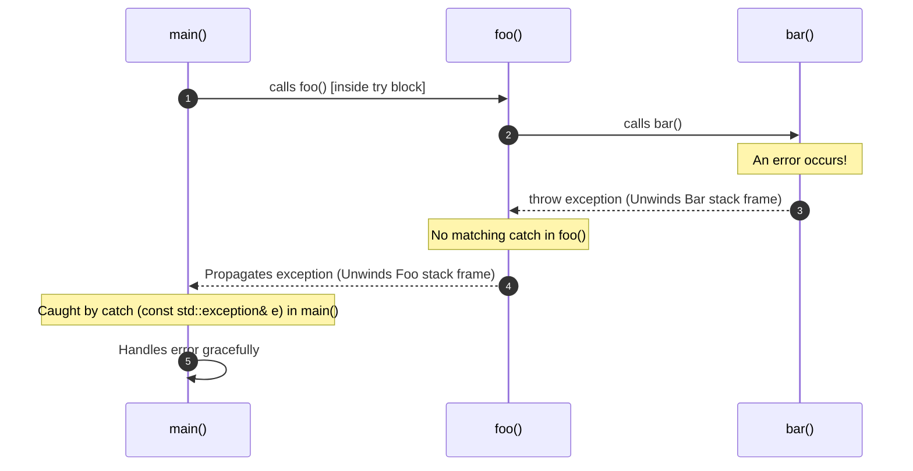

# Lecture 2.2: Exception Handling in C++ & STL Containers

## Overview

Software systems inevitably encounter runtime anomalies and invalid operations—such as out-of-bounds indexing, missing dictionary keys, memory exhaustion, or file access failures. 

In C++, **exceptions** provide a structured, type-safe mechanism to signal, propagate, and handle errors without polluting normal application logic with cumbersome error codes.

This module covers:
1. **The Motivation for Exceptions:** Handling unexpected events and separating error recovery from normal execution.
2. **C++ Exception Syntax & Semantics:** `try`, `throw`, `catch`, and type-matching rules.
3. **Stack Unwinding & Callee Propagation:** How exceptions traverse the call stack until handled.
4. **Container Exception Behavior:** Boundary checks and safety guarantees.
5. **Exercise 2.5 (.at() vs. operator[]):** Detailed architectural comparison of key lookups in `std::map`.

### Exception Control Flow Summary

| Phase | Keyword / Mechanism | Action Performed by Runtime |
|---|---|---|
| **1. Protected Block** | `try { ... }` | Designates a block of code monitored for exceptional conditions |
| **2. Fault Detection** | `throw expr;` | Halts normal execution, constructs exception object, initiates stack unwinding |
| **3. Stack Unwinding** | Automatic Destructors | Destroys local variables in reverse order of creation up the call stack |
| **4. Type Matching** | `catch (Type& e)` | Catches and handles the exception if the thrown object matches `Type` |
| **5. Unhandled Failure** | `std::terminate()` | Aborts the process immediately if no matching catch block is found |

---

## 1. Handling Unexpected Events at Runtime

During program execution, various external or logical failures can occur:
- **Arithmetic Faults:** Division by zero ($x / 0$).
- **Resource Failures:** Attempting to open a non-existent file or communicating over a broken network socket.
- **Memory Failures:** Heap exhaustion during dynamic allocation (`std::bad_alloc`).
- **Container Boundary Violations:** Accessing missing keys or invalid indices (`std::out_of_range`).

### Error Handling Strategies: Return Codes vs. Exceptions

| Dimension | Return Codes (C-Style) | Exceptions (Modern C++) |
|---|---|---|
| **Detection Obligation** | Optional (Easily ignored by caller) | **Mandatory** (Unhandled errors terminate program) |
| **Code Cleanliness** | Clutters return values and requires `if (err)` checks | Separates normal business logic from error handling |
| **Call Stack Traversal** | Every intermediate function must manually propagate error codes | **Automatic Stack Unwinding** directly to the relevant handler |
| **Constructor Failures** | Cannot return values from constructors | The **only** way to signal failure during object initialization |

---

## 2. Core Exception Syntax & Mechanics

C++ exception handling is built upon three fundamental keywords:
- **`throw`:** Signals that an exceptional condition has occurred and yields control by creating an exception object.
- **`try`:** Encloses a block of code in which exceptions might be thrown.
- **`catch`:** Defines a handler block that executes when a thrown exception matches its declared parameter type.

### Basic Syntax Example

```cpp
#include <iostream>

int foo(int x) {
    try {
        if (x < 0) {
            throw 20; // Throws an int error code
        }
        std::cout << "Valid input: " << x << '\n';
    }
    catch (int e) { // Type of e must match the thrown type
        std::cout << "An exception occurred. Exception Code: " << e << '\n';
    }
    return 0;
}
```

---

### Type-Matching in Multiple `catch` Blocks

When an exception is thrown, the runtime searches the sequential `catch` blocks from top to bottom, executing the **first catch block whose type matches or is a base class of the thrown object**:

```cpp
#include <iostream>
#include <string>

int process(int x) {
    try {
        if (x > 0) {
            throw 20; // Throws int
        } else if (x == 0) {
            throw "Zero value not allowed!"; // Throws const char*
        } else {
            throw std::string("Negative value error!"); // Throws std::string
        }
    }
    catch (int e) {
        std::cout << "Caught integer exception: " << e << '\n';
    }
    catch (const char* e) {
        std::cout << "Caught C-string exception: " << e << '\n';
    }
    catch (const std::string& e) {
        std::cout << "Caught std::string exception: " << e << '\n';
    }
    catch (...) { // Catch-all handler for any other type
        std::cout << "Caught unknown default exception.\n";
    }

    return 0;
}
```

> [!TIP]
> **Catch by Const Reference:** In modern C++, user-defined and standard library exceptions should always be caught by `const reference` (e.g., `catch (const std::exception& e)`) to prevent object slicing and avoid unnecessary copying.

---

## 3. Stack Unwinding & Callee Propagation

When an exception is thrown inside a deeply nested function (callee), and that function does not contain a matching `catch` block:
1. Execution of the current function halts immediately.
2. The runtime performs **stack unwinding**: local variables in the current stack frame are destroyed in reverse order of construction (invoking their destructors).
3. The exception propagates up to the calling function.
4. If the caller contains a matching `try-catch`, execution transfers to that `catch` block; otherwise, the stack continues unwinding until reaching `main()`.
5. If no handler catches the exception anywhere, `std::terminate()` is called, aborting the process.



### Code Example: Callee-to-Caller Propagation

```cpp
#include <iostream>
#include <stdexcept>

void bar() {
    // Deep callee throws an exception:
    throw std::runtime_error("Hardware sensor reading failed!");
}

void foo() {
    // foo does not handle the error; it simply calls bar()
    bar();
}

int main() {
    try {
        foo();
    }
    catch (const std::runtime_error& e) {
        // Exception successfully caught and handled at the top level
        std::cout << "main() caught exception: " << e.what() << '\n';
    }

    return 0;
}
```

---

## 4. Exceptions in STL Containers

STL containers throw standard exceptions (inheriting from `std::exception`) when operations violate container invariants or boundaries.

### Example 2.3: `.at()` Throws `std::out_of_range`

When querying a key in `std::map` using `.at("key")`, the method guarantees that if the key does not exist, it throws `std::out_of_range`:

```cpp
#include <iostream>
#include <map>
#include <string>
#include <stdexcept>

int main() {
    std::map<std::string, int> cart;

    try {
        // Attempting to access non-existent key "shoe":
        int val = cart.at("shoe");
        std::cout << "Price: " << val << '\n';
    }
    catch (const std::out_of_range& e) {
        std::cout << "Key not found in map: " << e.what() << '\n';
    }

    return 0;
}
```

---

### Non-Throwing Alternative: Key Inspection via `.find()`

If key absence is an expected, regular occurrence, using `try-catch` can introduce performance overhead. The canonical non-throwing pattern uses `.find()`:

```cpp
#include <iostream>
#include <map>
#include <string>

int main() {
    std::map<int, std::string> responses = {
        {0,  "Zero value!"},
        {-1, "Negative one!"},
        {2,  "Positive two!"}
    };

    int x;
    std::cout << "Enter an integer key: ";
    if (std::cin >> x) {
        auto it = responses.find(x);
        if (it != responses.end()) {
            std::cout << "Found: " << it->second << '\n';
        } else {
            std::cout << "Key not found. Default response.\n";
        }
    }

    return 0;
}
```

---

## 5. Exercise 2.5: `.at()` vs. `operator[]` in C++ Maps

**Question:** What is the technical and behavioral difference between `map.at(key)` and `map[key]` accesses in C++?

### Detailed Architectural Comparison

| Dimension | `map.at(key)` | `map[key]` |
|---|---|---|
| **Primary Purpose** | Read/write access with strict bounds checking | Read/write access with **default auto-insertion** |
| **Behavior When Key Exists** | Returns a reference to the existing mapped value | Returns a reference to the existing mapped value |
| **Behavior When Key is Missing** | **Throws `std::out_of_range`** exception | **Inserts a new key-value pair** `(key, Value())` with default-constructed value, then returns reference to it |
| **Const Map Compatibility** | **Yes** (has `const` overload: `const T& at(const Key&) const`) | **No** (cannot be called on `const std::map`) |
| **Mutation Risk** | Read operations never mutate the container | Read operations **silently mutate** the map by creating new nodes |
| **Performance Cost** | Key lookup ($O(\log n)$) + conditional check | Key lookup ($O(\log n)$) + potential node allocation & tree rebalance |

---

### Code Demonstration of the Difference

```cpp
#include <iostream>
#include <map>
#include <string>
#include <stdexcept>

int main() {
    std::map<std::string, int> scores;
    scores["Alice"] = 95;

    std::cout << "Initial map size: " << scores.size() << '\n'; // Size: 1

    // 1. Reading via operator[] on non-existent key:
    std::cout << "Bob score: " << scores["Bob"] << '\n';       // Prints: 0
    std::cout << "Size after scores['Bob']: " << scores.size() << '\n'; // Size: 2 (MUTATED!)

    // 2. Reading via .at() on non-existent key:
    try {
        std::cout << "Charlie score: " << scores.at("Charlie") << '\n';
    }
    catch (const std::out_of_range& e) {
        std::cout << "Caught expected exception: " << e.what() << '\n';
    }
    std::cout << "Size after scores.at('Charlie'): " << scores.size() << '\n'; // Size: 2 (UNCHANGED)

    return 0;
}
```

> [!WARNING]
> **Subscripting Mutation Trap:**
> Calling `map[key]` when merely inspecting data is a frequent source of bugs in C++. It inflates map size, triggers heap allocations, and causes subsequent `.contains(key)` checks to falsely report `true`. Use `.at()` or `.find()` for read-only access.

---

## 6. Key Takeaways

1. **Exceptions Separate Normal Flow from Failure Flow:** Errors can be signaled via `throw` and handled at any higher stack level without cluttering intermediate functions.
2. **Type Matching Controls Handlers:** `catch` blocks match by type; order handlers from most-derived type to most-base type, ending with `catch (...)` if needed.
3. **Automatic Stack Unwinding:** Local variables are destructed reliably when an exception propagates out of scope, preventing resource leaks when using RAII.
4. **Choose the Right Map Access Method:**
   - Use `map[key]` only when you explicitly intend to insert or overwrite.
   - Use `map.at(key)` when a missing key represents an exceptional error.
   - Use `map.find(key)` or `map.contains(key)` for non-throwing, non-mutating checks.
