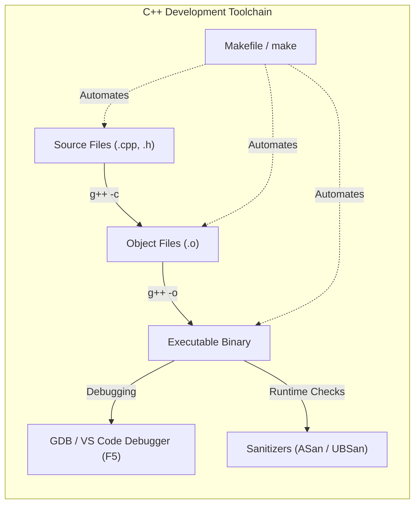
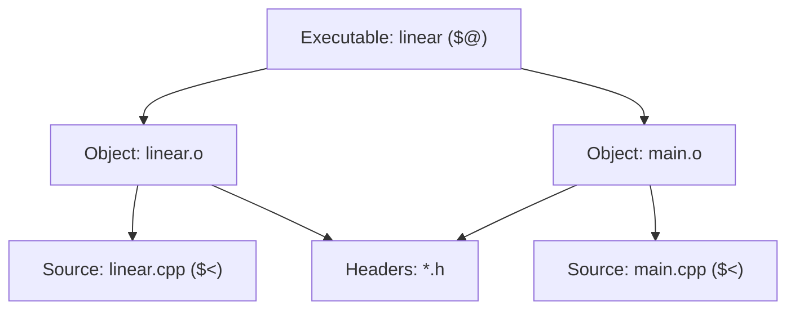

# Lecture 2: Developer Tooling — Compiler, Makefile, and Debugger

## Overview

Writing efficient data structures and algorithms requires robust tooling to compile, automate builds, and eliminate subtle memory or logic bugs. This lecture covers the essential development toolchain for C++ programming in **CS213/293**:

1. **The C++ Compiler (`g++`) and Safety Flags:** Using compiler diagnostics, warning flags, and runtime sanitizers (ASan and UBSan).
2. **Build Automation (`make` and `Makefile`):** Managing dependencies, incremental builds, pattern rules, and automatic variables.
3. **Debugging Tools (GDB & VS Code Interface):** Setting breakpoints, inspecting memory, stepping through code, and resolving runtime faults.



---

## 1. The C++ Compiler (`g++`)

We use the GNU Compiler Collection (`g++`) for compiling C++ programs. Compilers do not just produce machine code—they perform static analysis to detect potential bugs and enforce language standards.

### Standard Compiler Invocation
When compiling manually from the terminal:
```bash
g++ -g -Wall -Wextra -std=c++20 -o linear main.cpp linear.cpp
```

---

### Key Compiler Flags

| Flag | Category | Purpose and Mechanism |
|---|---|---|
| **`-g`** | Debugging | Inserts debugging symbols (DWARF format) into the binary. Enables debuggers (`gdb`, VS Code) to map machine instructions back to exact source code line numbers and variable names. |
| **`-Wall`** | Diagnostics | Enables standard compiler warnings for questionable code constructs (e.g., uninitialized variables, unused variables, missing return statements). |
| **`-Wextra`** | Diagnostics | Enables additional warning checks beyond `-Wall` (e.g., unsigned/signed comparison, unused parameters). |
| **`-std=c++20`** | Standard | Sets the language standard to C++20, enabling modern C++ language features, standard library improvements, and concept checks. |
| **`-Wshadow`** | Code Safety | Warns whenever a local variable or parameter shadows (hides) another variable, type, or global symbol from an outer scope. Prevents accidental variable misuse. |
| **`-Wpedantic`** | Portability | Enforces strict compliance with ISO C++ standards, rejecting non-standard vendor extensions and compiler-specific constructs. |
| **`-Werror`** | Quality Gate | Converts all compiler warnings into fatal errors. Compilation halts immediately if any warning is triggered, enforcing zero-warning codebases. |

---

### Runtime Sanitizers (`-fsanitize=...`)

Compilers can instrument binaries with lightweight runtime checks to catch bugs that produce undefined behavior or memory corruption:

```bash
g++ -g -fsanitize=address,undefined -std=c++20 -o linear main.cpp linear.cpp
```

#### 1. AddressSanitizer (ASan) — `-fsanitize=address`
Monitors memory allocations, pointer accesses, and deallocations. Catches:
- **Out-of-Bounds Accesses:** Buffer overflows on stack arrays, heap arrays (`new`/`malloc`), and global variables.
- **Use-After-Free:** Dereferencing pointers after the allocated memory has been deallocated (`delete`/`free`).
- **Double-Free / Invalid Free:** Deallocating the same memory block more than once or calling `delete` on an unallocated pointer.
- **Memory Leaks:** Allocations that are never freed before program exit.

#### 2. UndefinedBehaviorSanitizer (UBSan) — `-fsanitize=undefined`
Instruments code to trap undefined behavior at runtime. Catches:
- **Signed Integer Overflow:** e.g., arithmetic leading to values exceeding `INT_MAX`.
- **Division by Zero:** Integer or floating-point division/modulo by `0`.
- **Null Pointer Dereference:** Accessing `*ptr` when `ptr == nullptr`.
- **Misaligned Pointer Accesses:** Reading data from addresses not aligned with the type's memory boundary.
- **Out-of-Bounds Bit Shifts:** Shifting by negative offsets or bit widths $\ge$ operand size (e.g., `x << 32` on a 32-bit integer).

> [!TIP]
> **Debugging Recommendation:** Always include `-g -Wall -Wextra -Wshadow -fsanitize=address,undefined` during local development and lab exercises to detect memory errors instantly.

---

## 2. Build Automation with `make` & `Makefile`

As programs grow into multiple source (`.cpp`) and header (`.h`) files, recompiling every file manually after a small edit becomes slow and error-prone. A **Makefile** defines dependencies between files so that `make` only recompiles source files that have been modified.

### Anatomy of a Make Rule

```makefile
target: prerequisite1 prerequisite2 ...
	command
```

- **Target:** The file to be generated (e.g., `linear`, `main.o`) or a labeled action to execute (e.g., `clean`, `all`, `runtests`).
- **Prerequisites (Dependencies):** Files that must exist and be up to date before the target can be built. If any prerequisite has a modification timestamp newer than the target, the target is rebuilt.
- **Command (Recipe):** The shell command executed to create the target.

> [!IMPORTANT]
> **Tab Requirement:** Every command line in a Makefile recipe **MUST begin with a literal Tab character (`\t`)**, not spaces. Using spaces causes Make syntax errors (`Makefile: missing separator`).

---

### Core Makefile Concepts

1. **Default Target:** Running `make` without arguments automatically executes the very first target defined in the file (conventionally `all` or `build`).
2. **Variables:** Store compiler names, flags, and file lists to avoid repetition and simplify configuration:
   - Example: `CXX = g++`, `CXXFLAGS = -g -Wall -std=c++20`
   - Variable expansion syntax: `$(CXX)` or `$(CXXFLAGS)`
3. **Phony Targets (`.PHONY`):**
   Targets like `clean` or `runtests` represent actions, not actual files on disk. Declaring them with `.PHONY` guarantees they always run, even if a file named `clean` or `runtests` happens to exist in the directory:
   ```makefile
   .PHONY: all build runtests clean
   ```
4. **Automatic Variables:**
   Make provides shorthand variables for use inside recipes:
   - **`$@`**: Expands to the target name.
   - **`$<`**: Expands to the **first** prerequisite.
   - **`$^`**: Expands to **all** prerequisites (separated by spaces).



---

### Incremental Compilation Explained

Consider a project with two source files: `linear.cpp` and `main.cpp`.
- If `linear.cpp` is edited, only `linear.cpp` is recompiled to `linear.o`.
- `main.cpp` is **not** recompiled because `main.o` is already newer than `main.cpp`.
- The final step simply links `linear.o` and `main.o` to produce `linear`.

This incremental process saves significant compilation time in large codebases.

---

### Example 2.1: Basic Rule
```makefile
a.out: hello.cpp
	g++ hello.cpp -o a.out
```

---

### Complete Lab Makefile Template

The following Makefile is structured for lab assignments and projects:

```makefile
# Compiler
CXX = g++

# Compiler flags
CXXFLAGS = -g -Wall -Wextra -std=c++20

# Source files
SOURCES = linear.cpp main.cpp

# Object files: replaces .cpp suffix with .o (e.g., linear.o main.o)
OBJECTS = $(SOURCES:.cpp=.o)

# Final executable name
EXEC = linear

# Declare phony targets that do not produce physical files
.PHONY: all build runtests clean

# Default target: builds the binary and immediately runs test suite
all: build runtests

# Build target: links the executable
build: $(EXEC)

# Linking step: links all object files into the final executable binary
$(EXEC): $(OBJECTS)
	$(CXX) $(CXXFLAGS) -o $(EXEC) $(OBJECTS)

# Compilation pattern rule: compiles each .cpp file into a .o object file
# Recompiles if the .cpp file or any header file (*.h) changes
%.o: %.cpp *.h
	$(CXX) $(CXXFLAGS) -c $< -o $@

# Run tests target: executes the compiled binary
runtests: $(EXEC)
	./$(EXEC)

# Clean target: removes all generated object files and executables
clean:
	rm -f $(OBJECTS) $(EXEC)
```

---

### Variations for the `runtests` Target

Depending on how lab test cases are structured, the `runtests` recipe can be configured in multiple ways:

#### 1. Input Redirection from a Single File
```makefile
runtests: $(EXEC)
	./$(EXEC) < input.txt
```

#### 2. Automated Python Test Runner
```makefile
runtests: $(EXEC)
	python3 test_runner.py ./$(EXEC)
```

#### 3. Batch Testing Over Multiple Test Files
```makefile
runtests: $(EXEC)
	@for test in test/test*/input.txt; do \
		echo "Running $$test..."; \
		./$(EXEC) < $$test; \
	done
```

---

## 3. Running `make` Commands

| Command | Action Performed |
|---|---|
| **`make`** or **`make all`** | Builds the binary `linear` and automatically runs the test suite (`runtests`). |
| **`make build`** | Compiles and links the source code to produce the executable `linear`. |
| **`make runtests`** | Executes the test suite on the compiled binary. |
| **`make clean`** | Deletes all `.o` object files and the `linear` binary to ensure a clean rebuild. |

---

## 4. Debugging with GDB & VS Code

Debugging is the systematic process of finding and resolving bugs, logical flaws, and runtime crashes (such as `Segmentation fault (core dumped)`).

### Command-Line Debugging with GDB

When an executable is compiled with `-g`, it can be launched inside GDB:

```bash
gdb ./linear
```

#### Essential GDB Commands

| GDB Command | Shorthand | Description |
|---|:---:|---|
| `break <location>` | `b` | Sets a breakpoint at a function (`b main`) or line number (`b linear.cpp:15`). |
| `run` | `r` | Starts program execution. Can pass arguments or redirection: `r < input.txt`. |
| `next` | `n` | Executes the next line of code (**steps over** function calls). |
| `step` | `s` | Executes the next line of code (**steps into** function calls). |
| `continue` | `c` | Resumes execution until the next breakpoint or program termination. |
| `print <expr>` | `p` | Evaluates and prints the value of a variable or expression (`p S[mid]`, `p first`). |
| `display <expr>` | | Automatically prints the variable's value at every breakpoint/step. |
| `backtrace` | `bt` | Displays the call stack showing the exact chain of functions leading to a crash. |
| `watch <var>` | | Sets a watchpoint that pauses execution whenever the variable's value changes. |
| `quit` | `q` | Exits the GDB debugger. |

---

### VS Code Graphical Debugger Interface

In **CS213/293** lab environments, problem directories are pre-configured with VS Code debugging configurations:

1. **Opening Problem Directory:** Open the lab folder containing `linear.cpp`, `Makefile`, and the `.vscode` directory in VS Code.
2. **Setting Breakpoints:** Click in the margin to the left of any line number in `linear.cpp` to place a red breakpoint dot.
3. **Starting Debugger (`F5`):**
   - Press **`F5`** or navigate to **Run $\to$ Start Debugging**.
   - The program runs and automatically pauses execution at the first active breakpoint.
4. **Inspecting State:**
   - **Variables Pane:** View all local, global, and register values in real time.
   - **Watch Pane:** Add custom expressions (e.g., `last - first`, `S[mid]`).
   - **Call Stack:** Inspect active stack frames and function calls.
   - **Debug Console:** Evaluate arbitrary C++ expressions while paused.
5. **Configuring Inputs in `.vscode/launch.json`:**
   To change the test file input during debugging, modify the `args` or input redirection in `.vscode/launch.json`:
   ```json
   {
       "version": "0.2.0",
       "configurations": [
           {
               "name": "C++ Debug",
               "type": "cppdbg",
               "request": "launch",
               "program": "${workspaceFolder}/linear",
               "args": [],
               "stopAtEntry": false,
               "cwd": "${workspaceFolder}",
               "environment": [],
               "externalConsole": false,
               "MIMode": "gdb",
               "setupCommands": [
                   {
                       "description": "Enable pretty-printing for gdb",
                       "text": "-enable-pretty-printing",
                       "ignoreFailures": true
                   }
               ],
               "preLaunchTask": "build"
           }
       ]
   }
   ```

---

## 5. Summary & Best Practices

1. **Automate with Make:** Always use a Makefile to handle multi-file builds and test runs reliably.
2. **Compile with Warnings & Sanitizers:** Never ignore compiler warnings. Use `-Wall -Wextra -Wshadow` and `-fsanitize=address,undefined` to eliminate undefined behavior before submitting code.
3. **Debug Incrementally:** Use breakpoints and watch expressions rather than inserting temporary `cout` statements. Inspect pointer values and boundary indices (`first`, `last`, `mid`) step-by-step.

