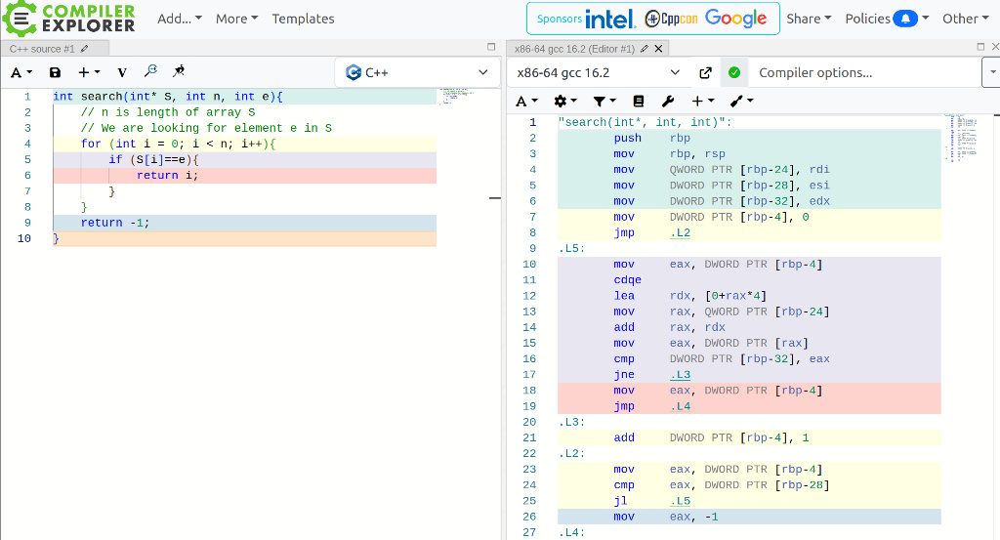
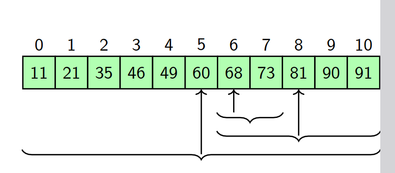

# Why Study Data Structures?

## Learning goals

By the end of this lecture, you should be able to:

- distinguish data, a problem, and an algorithm;
- write a precise specification for a search problem;
- explain why organizing data can make a problem much faster to solve; and
- compare linear search with binary search on a sorted array.

## 1. Data and computation

**Data** is information about things, rather than the things themselves. For example, a person's age, a tree's height, a stock's price, or a post's number of likes are all data.

Modern applications collect very large amounts of data. To solve useful problems—such as weather prediction, web search, or fingerprint recognition—we must process that data. When data is disorganized, even a simple operation such as finding one item can take a long time.

> **Central idea:** The way data is organized can be used to design more efficient algorithms.

This is the purpose of studying data structures: they represent and organize data so that required operations can be performed efficiently.

## 2. Problems are specifications

A computational **problem** is defined by two parts:

1. **Input specification** — the form and conditions of the input.
2. **Output specification** — what result must be produced for a valid input.

### Example: search

| Part | Specification |
| --- | --- |
| Input | An array `S` of elements and an element `e`. |
| Output | A position of `e` in `S` if `e` occurs; otherwise `-1`. |

The output specification is expressed using the input: the returned position must refer to the given array `S` and element `e`.

### Important edge case

If `e` occurs more than once, the specification above permits returning **any** position containing `e`. If the application requires the first or last occurrence, that requirement must be stated explicitly.

## 3. Algorithms and programs

An **algorithm** is a finite, step-by-step method that solves a problem. It accepts an input satisfying the input specification and produces an output satisfying the output specification.

Several different algorithms may solve the same problem. They can differ greatly in the amount of time or memory they need.

A **program** is a concrete implementation of an algorithm in a programming language. An algorithm is language-independent; a program also includes implementation details such as syntax, types, input/output, and interaction with a machine.

## 4. Linear search: no structure to exploit

For an arbitrary (unsorted) array, a direct solution is to inspect each element from left to right until the target is found.

```cpp
int search(const int* S, int n, int e) {
    for (int i = 0; i < n; ++i) {
        if (S[i] == e) {
            return i;
        }
    }
    return -1;
}
```

### Running time — Exercise 1.5

**Question:** What is the running time when `e` is not in `S`?

In that case, the loop completes all `n` iterations. The analysis below counts an abstract set of machine-level operations. It is a cost model: a compiler may emit different instructions, but the count makes the growth of the program explicit.

#### Arithmetic and comparison operations: `(3n + 2)TArith`

| Operation | Number of executions |
| --- | ---: |
| Initialization: `i = 0` | `1` |
| Loop condition: `i < n` | `n + 1` |
| Equality check: `S[i] == e` | `n` |
| Increment: `i++` | `n` |
| **Total** | **`3n + 2`** |

The loop condition has one additional execution: its final false evaluation when `i = n`.

#### Jump and branch operations: `(2n + 1)TJump`

In a typical unoptimized assembly layout, control first jumps to the loop-condition check, then branches after the equality check and after the loop-condition check.

| Operation | Number of executions |
| --- | ---: |
| Initial jump to the loop condition | `1` |
| Equality-test branch when no match is found | `n` |
| Loop-condition branch that repeats the loop | `n` |
| **Total** | **`2n + 1`** |

There are also `n` reads of `S[i]` and one final `return -1`.

Let `TRead`, `TArith`, `TJump`, and `TReturn` be the times for an array read, arithmetic/comparison operation, jump, and return, respectively. The total running time is:

\[
T(n) = nT_{Read} + (3n + 2)T_{Arith} + (2n + 1)T_{Jump} + T_{Return}
\]

All operation counts are linear in `n`, so this exact expression simplifies asymptotically to **Θ(n)**, and hence **O(n)**. This is a useful distinction:

- the expression above is a **machine-operation cost model**;
- Θ(n) is its **growth-rate summary**, independent of fixed instruction costs.

The exact constants can vary with the compiler, processor, and generated assembly, but the number of loop iterations—and therefore the linear growth—does not.

### From assembly code to CPU cycles to Big-O

The compiler converts the C++ function first into **assembly language** and then into the binary machine instructions executed by the CPU. The exact assembly depends on the compiler, optimization level, and processor. For example, an optimized x86-64 compiler may produce a loop *similar to* this (register choices and labels are not important):



```asm
# rdi = address of S, rsi = n, edx = e, rax = i
.loop:
    cmpl  %edx, (%rdi,%rax,4)  # compare S[i] with e
    je    .found               # if equal, return i
    addq  $1, %rax             # i++
    cmpq  %rsi, %rax           # compare i with n
    jne   .loop                # repeat while i != n
```

For a failed search, this loop runs `n` times. Each iteration executes a constant-sized group of instructions: one memory read/compare, one increment, one bound comparison, and conditional branches. This is the assembly-level origin of the operation counts in Exercise 1.5.

The CPU does not run the written assembly text; it runs its assembled machine-code equivalent. Every machine instruction consumes CPU resources and takes one or more **CPU clock cycles**. If a processor runs at clock frequency `f` hertz, one clock cycle lasts

\[
T_{clock} = \frac{1}{f}\text{ seconds}.
\]

For example, at `3 GHz`, a clock cycle is approximately `1 / (3 × 10⁹)` seconds, or `0.33 ns`. Suppose this particular loop costs an average of `c` cycles per iteration, including its load, comparisons, and branch. For a failed search:

\[
\text{cycles}(n) \approx cn+d,
\]

where `d` is the fixed setup and return cost. The corresponding elapsed CPU time is

\[
\text{CPU time} \approx \frac{cn+d}{f}\text{ seconds}.
\]

This explains how a machine-level cost model such as

\[
nT_{Read} + (3n+2)T_{Arith} + (2n+1)T_{Jump} + T_{Return}
\]

is obtained: count how often each kind of work appears in the assembly, then multiply by its cost. In practice, `c` is an average rather than a universal fixed number:

- a memory read may be fast if the value is in cache, or much slower after a cache miss;
- modern CPUs can pipeline or execute independent instructions in parallel;
- branch prediction affects the cost of conditional jumps; and
- a compiler may optimize, rearrange, or even remove instructions.

The constants `c`, `d`, and `f` change between machines and builds. To compare algorithms in a machine-independent way, we retain only how the running time grows as input size `n` grows:

\[
cn+d \in \Theta(n).
\]

Therefore, failed linear search has **linear time**, written **Θ(n)** (and consequently **O(n)**). Big-O deliberately ignores the constant cycles per iteration, clock speed, and lower-order terms; it answers the more durable question: *how does the work scale when the input becomes large?*

> In a function parameter list, `int S[]` and `int* S` describe the same parameter type in C/C++. Array indexing is equivalent to pointer-offset dereferencing: `S[i]` means `*(S + i)`.

## 5. Structured data enables faster search

Now strengthen the input specification:

| Part | Specification |
| --- | --- |
| Input | A **non-decreasing (sorted)** array `S` and an element `e`. |
| Output | A position of `e` in `S` if it occurs; otherwise `-1`. |

Sorting is useful structure. On comparing `e` with the middle element:

- if the middle element equals `e`, the search is complete;
- if it is greater than `e`, `e` cannot appear in the right half;
- if it is less than `e`, `e` cannot appear in the left half.

Thus, one comparison discards roughly half of the remaining search space. Repeating this process gives **binary search**.



## 6. Binary search

The following version searches a sorted array using the half-open interval `[first, last)`: `first` is included and `last` is excluded.

```cpp
int binarySearch(const int* S, int n, int e) {
    int first = 0;
    int last = n;

    while (first < last) {
        int mid = first + (last - first) / 2;

        if (S[mid] == e) {
            return mid;
        }
        if (S[mid] > e) {
            last = mid;
        } else {
            first = mid + 1;
        }
    }
    return -1;
}
```

### Why the interval updates are correct

- When `S[mid] > e`, the sorted order guarantees that `e` cannot be at `mid` or to its right, so the new interval is `[first, mid)`.
- When `S[mid] < e`, `e` cannot be at `mid` or to its left, so the new interval is `[mid + 1, last)`.

The interval becomes smaller in every iteration. If it becomes empty, then `e` is not in the array.

### Running time comparison

| Algorithm | Required input structure | Worst-case elements/comparisons | Time complexity |
| --- | --- | --- | --- |
| Linear search | None | `n` | O(n) |
| Binary search | Sorted array | about `log₂ n` | O(log n) |

For example, binary search needs at most about 20 halving steps to narrow a search among one million elements, whereas a failed linear search may inspect all one million.

### Exercise 1.6: binary search when the target is too small

Assume the intended expression is \(n = 2^k - 1\), and `S[0] > e`. Because the array is non-decreasing, `e` is smaller than **every** element of `S`.

At every iteration, binary search compares `e` with the middle element and takes the `S[mid] > e` branch. It discards the right half, including `mid`, leaving the left half.

\[
2^k - 1 \;\to\; 2^{k-1} - 1 \;\to\; \cdots \;\to\; 1 \;\to\; 0
\]

There are exactly `k` iterations (halvings) before the interval is empty. Thus:

- counting one three-way middle-element comparison per iteration: `k` comparisons;
- in the C++ code as written, which tests `S[mid] == e` and then `S[mid] > e` separately: `2k` element-comparisons, because equality is false every time;
- including loop-condition checks adds `k + 1` further control comparisons.

All of these counts are proportional to `k`. Since \(k = \log_2(n+1)\), the running time is **Θ(log n)**, and therefore **O(log n)**.

## 7. Takeaways

- Precise input and output specifications define a problem.
- Algorithms solve specifications; programs implement algorithms.
- Unstructured data may force us to inspect many items.
- Useful data structure properties—such as sorted order—allow algorithms to eliminate impossible cases quickly.
- The benefit of a data structure must be considered with its costs: keeping an array sorted can itself require work when elements are inserted or removed.

## Practice questions

1. How would the search specification change if it must return the first occurrence of `e`?
2. What is the best-case running time of linear search? Of binary search?
3. Why is binary search incorrect if the array is not sorted?
4. Trace binary search for `68` in a sorted array of your choice, writing the interval after each comparison.

## Source priority

The core definitions, examples, and presentation in these notes follow the supplied IIT Bombay lecture material. The distinctions between algorithms and programs, the half-open interval explanation, and the implementation cautions are supplementary clarifications added to make the notes self-contained.
