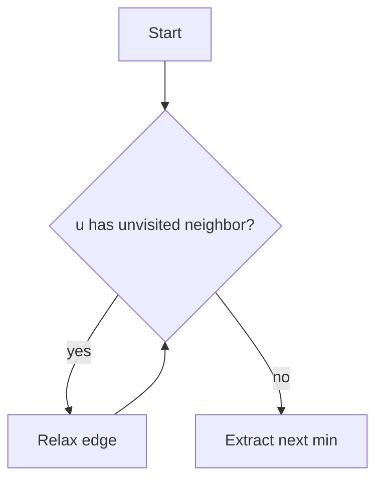

# Math Notation for Algorithm Docs in Markdown

The core job of this skill: get subscripts, superscripts, exponentials, polynomials, and other math notation to actually render correctly in Markdown — this is the main thing to get right, more than document structure. Markdown is the *final* format here — do not route this into Pandoc/Word/PDF/LaTeX pipelines unless the user explicitly asks for one of those later.

## Notation reference — read this first

**Know your renderer.** Markdown has no native subscript/superscript/math syntax — it all depends on what renders the file. If you don't know the target (GitHub, Obsidian, VS Code preview, a plain text viewer, a custom app), ask, or default to the LaTeX approach below since it's the most common in scientific Markdown, and say which assumption you made.

### Superscripts and exponentials

| Context | Syntax | Renders as |
|---|---|---|
| LaTeX (GitHub/GitLab/Obsidian/most renderers) | `$n^2$`, `$2^n$`, `$x^{i+1}$` | $n^2$, $2^n$, $x^{i+1}$ |
| HTML fallback (works in any Markdown that passes through raw HTML) | `n<sup>2</sup>`, `2<sup>n</sup>` | n², 2ⁿ |
| Plain-text-only (no HTML/LaTeX support) | `n^2` or Unicode superscript chars (`n²`, `2ⁿ`) | n^2 / n² |

Always wrap the *whole* exponent in braces when it's more than one character: `$x^{n+1}$` not `$x^n+1$` (the latter renders as $x^n+1$, not $x^{n+1}$ — a common and easy-to-miss error).

### Subscripts

| Context | Syntax | Renders as |
|---|---|---|
| LaTeX | `$x_i$`, `$a_{n+1}$`, `$x_{i,j}$` | $x_i$, $a_{n+1}$, $x_{i,j}$ |
| HTML fallback | `x<sub>i</sub>` | xᵢ |
| Plain-text-only | `x_i` or Unicode subscript chars where they exist (`x₀`, `x₁`) | x_i / x₀ |

Same brace rule as superscripts: multi-character subscripts need braces (`$x_{i+1}$`, not `$x_i+1$`).

Combined sub+superscript: `$x_i^2$` (subscript then superscript, in that order) renders correctly in LaTeX; get the order right since `$x^2_i$` also works in LaTeX but HTML fallback (`x<sub>i</sub><sup>2</sup>`) requires you pick one order and stay consistent within a doc.

### Polynomials

Write polynomials as a sum of terms with explicit `+`/`-`, each exponent properly braced:
- `$f(x) = a_n x^n + a_{n-1} x^{n-1} + \dots + a_1 x + a_0$`
- Degree-2 example: `$f(x) = 3x^2 - 5x + 2$`
- Don't compress terms into implicit multiplication without a coefficient check — `$2x^2$` not `$2 x ^2$` (stray spaces around `^` don't break LaTeX but are inconsistent style; keep it tight).

### Common algorithmic math constructs

| Construct | LaTeX | Notes |
|---|---|---|
| Big-O / complexity | `$O(n \log n)$`, `$\Theta(n^2)$`, `$\Omega(n)$` | Use `\log`, not `log` — renders upright instead of italic |
| Summation | `$\sum_{i=1}^{n} a_i$` | Bounds go in `_{}` (lower) and `^{}` (upper) |
| Product | `$\prod_{i=1}^{n} a_i$` | Same bound pattern as summation |
| Recurrence | `$T(n) = 2T(n/2) + O(n)$` | Show recurrence → expansion → closed form as separate lines, not one run-on |
| Limits | `$\lim_{n \to \infty} \frac{f(n)}{g(n)}$` | `\to` for arrows, `\frac{}{}` for fractions |
| Floor/ceiling | `$\lfloor n/2 \rfloor$`, `$\lceil n/2 \rceil$` | Don't use plain brackets — they lose the floor/ceiling meaning |
| Set membership | `$x \in S$`, `$S \subseteq T$` | |
| Matrices | ```$$\begin{bmatrix} a & b \\ c & d \end{bmatrix}$$``` | Block math only, never inline |

### Inline vs. block math

- Inline (`$...$`): use inside a sentence — `The runtime is $O(n \log n)$ in the average case.`
- Block (`$$...$$` on its own lines): use for derivations, multi-step algebra, or anything with its own visual weight (matrices, multi-line recurrences, aligned equation systems). Never cram a block-worthy expression inline just to save a line break.
- For multi-step derivations, use `\begin{aligned}...\end{aligned}` inside a block so each line's `=` aligns:
```
$$
\begin{aligned}
T(n) &= 2T(n/2) + n \\
     &= 4T(n/4) + 2n \\
     &= O(n \log n)
\end{aligned}
$$
```

### Self-check before shipping any math-heavy doc

Before finalizing, scan the doc for these common mistakes:
- Unbraced multi-character exponents/subscripts (`x^n+1` instead of `x^{n+1}`)
- Mixed notation styles in the same document (LaTeX in one section, `n^2` plain-text in another) — pick one and apply it throughout
- `log`/`min`/`max`/`lim` typed as plain text inside math mode instead of `\log`/`\min`/`\max`/`\lim` (renders in the wrong font otherwise)
- Plain brackets used where floor/ceiling was meant
- A renderer assumption that was never confirmed with the user, on a doc where the wrong assumption would make every formula garbled

## When to use this

Use for documents like:
- Write-ups explaining and analyzing an algorithm (how it works, why it's correct, how fast it is)
- Comparisons between algorithms/data structures (e.g. quicksort vs. mergesort, B-tree vs. LSM-tree)
- Lab-report-style documents on an implementation and its empirical performance
- Short "algorithm notes" meant to read like a mini scientific paper
- Any Markdown document that needs correct exponents, subscripts, polynomials, or formulae — even a single formula in an otherwise short doc

Not for: slide decks (use pptx skill), Word deliverables (use docx skill), or informal chat explanations that don't need to exist as a standalone document.

## Document structure (secondary — notation above is the priority)

When the doc is a full write-up rather than a single formula, this skeleton is a reasonable default. Drop sections that don't apply; don't pad with empty ones.

1. **Title**, **Abstract** — 3–6 sentences: problem, approach, key result (complexity bound, speedup, correctness guarantee).
2. **Problem Definition** — Formal statement of input/output/constraints. Define every symbol before using it (e.g. "Let $G = (V, E)$ be a weighted directed graph with $|V| = n$ vertices and $|E| = m$ edges.").
3. **Algorithm Description** — Prose idea first, pseudocode second.
4. **Correctness** (when relevant) — Invariants or a proof sketch, stated explicitly.
5. **Complexity Analysis** — Derive, don't assert: show the recurrence or summation (using the notation patterns above), then the closed form.
6. **Empirical Results** (if applicable) — Setup, then results as a table.
7. **Comparison** (if applicable) — Comparison table (see below).
8. **Conclusion**, **References**.

`##` for these sections, `###` sparingly for subdivisions (e.g. "### Best Case" / "### Worst Case").

## Pseudocode conventions

Render pseudocode in a fenced code block, language-tagged `text` or `plaintext` (not a real language, since it isn't runnable code):

```text
ALGORITHM Dijkstra(G, source)
    dist[source] ← 0
    for each vertex v ≠ source:
        dist[v] ← ∞
    Q ← priority queue of all vertices, keyed by dist
    while Q is not empty:
        u ← Extract-Min(Q)
        for each edge (u, v) with weight w:
            if dist[u] + w < dist[v]:
                dist[v] ← dist[u] + w
                Decrease-Key(Q, v, dist[v])
    return dist
```

Rules:
- Number lines only if the prose needs to reference specific lines (`1:`, `2:` prefixes); otherwise leave unnumbered for readability.
- Use `←` for assignment, standard math symbols (`∞`, `∈`, `≠`) rather than ASCII approximations, and consistent indentation (4 spaces).
- Name the algorithm in an `ALGORITHM Name(params)` header line.
- If a runnable reference implementation is also wanted, put it in a *separate* fenced block with the real language tag (```python, ```rust, etc.), clearly labeled "Reference implementation" so it's not confused with the pseudocode.

## Diagrams

For algorithm flow, state machines, or DAG structure, use a fenced ` ```mermaid ` block (renders natively in GitHub/GitLab/most Markdown viewers):



For simple trees or linked structures where Mermaid is overkill, a small fixed-width ASCII diagram in a fenced ` ```text ` block is fine. Don't reach for Mermaid for anything with more than ~15 nodes — describe it in prose plus a table instead, since large auto-laid-out diagrams tend to render illegibly.

## Comparison tables

When comparing algorithms/data structures, use a Markdown table with consistent columns across every row — don't add asymmetric detail to one row:

```markdown
| Algorithm | Time (avg) | Time (worst) | Space | Stable? |
|---|---|---|---|---|
| Quicksort | $O(n \log n)$ | $O(n^2)$ | $O(\log n)$ | No |
| Mergesort | $O(n \log n)$ | $O(n \log n)$ | $O(n)$ | Yes |
```

## Citations

Ask the user which style they want if it's not already clear from context; don't silently pick BibTeX machinery they didn't ask for. Two lightweight options that stay pure-Markdown (no Pandoc dependency):

**Numbered bracket style** (most common for algorithm write-ups):
- In-text: `Dijkstra's original formulation assumes non-negative edge weights [1].`
- References section, plain list:
```markdown
## References

1. E. W. Dijkstra, "A note on two problems in connexion with graphs," *Numerische Mathematik*, 1959.
2. R. Bellman, "On a routing problem," *Quarterly of Applied Mathematics*, 1958.
```

**Author-year style**: `(Dijkstra, 1959)` inline, alphabetized reference list. Pick one style and use it consistently for the whole document — don't mix numbered and author-year.

If the user says they don't need formal citations, still name algorithms/techniques by their common attribution in prose (e.g. "using the Floyd–Warshall approach") without a formal reference list.

## Writing style

- State results directly ("This algorithm runs in $O(n \log n)$ time") rather than hedging ("this algorithm might run in roughly $O(n \log n)$ time or so").
- Active voice, present tense for describing what the algorithm does.
- Define every symbol before its first use.
- Prefer precision over padding — a correct three-sentence complexity argument beats a vague seven-sentence one.
- Don't restate the pseudocode in prose line-by-line; explain the *idea* the pseudocode implements.

## Output

Write the final document as a single `.md` file via `create_file`, save it to `/mnt/user-data/outputs/`, and share it with `present_files`. Don't use the `docx` or `pptx` skills for this deliverable even if the content is "paper-like" — Markdown is the requested final format.
