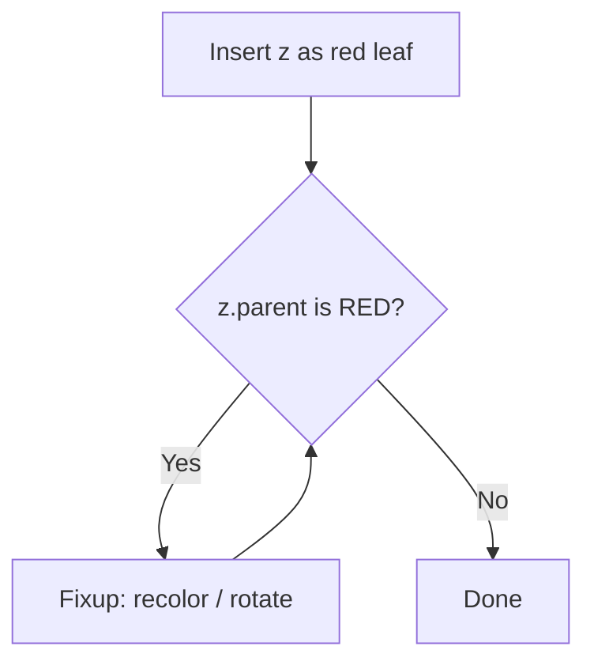

# CS213/293 Data Structures & Algorithms — Note-Writing Skill

The core job of this skill: turn a CS213/293 topic (from a lecture, a lecture PDF, or a course-syllabus item) into a Markdown study note that matches how the course is actually taught and examined — pseudocode-first, efficiency-first, tutorial-problem aware — while getting subscripts, superscripts, exponents, and other math notation to render correctly. Markdown is the *final* format here — do not route this into Pandoc/Word/PDF/LaTeX pipelines unless the user explicitly asks for one of those later.

## Course context (know this before writing)

- **Course**: CS213/293, Data Structure and Algorithms, IIT Bombay, Instructor Ashutosh Gupta.
- **Textbook**: *Introduction to Algorithms*, 3rd ed. (CLRS) — align terminology and pseudocode conventions with CLRS unless the user's lecture material diverges.
- **Syllabus rule**: only content *before* the problems section of a lecture's slides is examinable; any concept introduced only inside a problem is not in scope for notes unless the user asks for it explicitly. When summarizing a lecture PDF, keep this boundary — don't smuggle in problem-only definitions as if they were core material.
- **Course topic order** (use this to decide where a note fits and which prerequisites to assume already covered):

| Block | Topics |
|---|---|
| Week 1 | Introduction, binary search, Big-O, containers |
| Week 2 | Stack, queue — array and (circular/doubly) linked-list implementations, growth |
| Week 3 | Dictionary problem, hashing, hash functions, open addressing |
| Week 4–6 | Trees, tree walks, BST (search/insert/min/successor/delete), average BST insertion time, red-black trees (insert, delete) |
| Week 7 | Priority queue, heap and its operations, union-find |
| Week 8 | Pattern matching, KMP, tries, suffix trees |
| Week 9 | Huffman coding, optimal compression, LZ77, Deflate |
| Week 10–11 | Graph basics, BFS, DFS, 2-edge-connectivity, topological sort, strongly connected components |
| Week 12–13 | MST (Kruskal, Prim), Dijkstra's shortest path, sorting (merge, quick, radix, bucket), comparison-sort lower bound |

- **Exam-driven emphasis**: the course explicitly rewards *efficient* algorithms and *pseudocode* — "you may not get any marks for inefficient algorithms" and "please write pseudo codes when we ask for the algorithms" are stated exam rules. Notes should therefore always give the efficient version first (mention a naive version only as a contrast, not as the main content), and always include pseudocode for anything algorithmic — never just prose description.

## Notation reference — read this first

Markdown has no native subscript/superscript/math syntax — it all depends on the renderer. If the target renderer isn't stated (Obsidian, VS Code preview, GitHub, a plain viewer), default to the LaTeX approach below, since it's what CLRS-style notes conventionally use, and say which assumption you made.

### Superscripts and exponentials

| Context | Syntax | Renders as |
|---|---|---|
| LaTeX (GitHub/GitLab/Obsidian/most renderers) | `$n^2$`, `$2^n$`, `$x^{i+1}$` | $n^2$, $2^n$, $x^{i+1}$ |
| HTML fallback | `n<sup>2</sup>`, `2<sup>n</sup>` | n², 2ⁿ |
| Plain-text-only | `n^2` or Unicode (`n²`, `2ⁿ`) | n^2 / n² |

Always brace multi-character exponents: `$2^{n-1}$` not `$2^n-1$` (the latter renders as $2^n-1$, a different expression — this specific slip is common when writing hash-table load-factor or heap-height bounds).

### Subscripts

| Context | Syntax | Renders as |
|---|---|---|
| LaTeX | `$x_i$`, `$a_{i+1}$`, `$T[i,j]$` | $x_i$, $a_{i+1}$, $T[i,j]$ |
| HTML fallback | `x<sub>i</sub>` | xᵢ |
| Plain-text-only | `x_i` or Unicode (`x₀`, `x₁`) | x_i / x₀ |

Same brace rule: `$h_{i+1}(k)$` for a rehash sequence, not `$h_i+1(k)$`.

Combined sub+superscript (common for hash probe sequences and tree heights): `$h_i^{(2)}(k)$`. Pick one ordering convention and keep it fixed across the whole note.

### Common CS213/293 math constructs

| Construct | LaTeX | Notes / where it shows up |
|---|---|---|
| Complexity | `$O(n \log n)$`, `$\Theta(n)$`, `$\Omega(\log n)$` | Use `\log`, `\lg`, `\ln` — never plain `log` inside math mode |
| Amortized bound | `$O(1)$ amortized` | State amortized vs. worst-case explicitly — stacks/queues, union-find, and hash-table growth all rely on this distinction |
| Recurrence | `$T(n) = 2T(n/2) + O(n)$` | Show recurrence → expansion → closed form as separate display lines (see block-math rule below); this is exactly how MST/mergesort/QuickSelect bounds should be derived |
| Load factor | `$\alpha = n/m$` | Hashing section: define $n$ = elements stored, $m$ = table size before first use |
| Hash function | `$h(k) = k \bmod m$`, `$h_i(k) = (h_1(k) + i \cdot h_2(k)) \bmod m$` | Use `\bmod`, not plain `mod` |
| Tree height | `$h = \lceil \lg(n+1) \rceil - 1$` | Use `\lceil`/`\rceil`, `\lfloor`/`\rfloor` — never plain brackets |
| Summation / potential function | `$\sum_{i=1}^{n} c_i$`, `$\Phi(D_i)$` | Amortized-analysis potential arguments (stack, union-find) need this |
| Graph notation | `$G = (V, E)$`, `$\lvert V \rvert = n$`, `$\lvert E \rvert = m$` | Define $n$, $m$ once per graph note and reuse consistently |
| Shortest-path/MST weight | `$w(u,v)$`, `$d(s,v)$` | Distinguish edge weight $w$ from computed distance $d$ — a frequent mix-up in Dijkstra/Prim notes |
| Entropy (compression) | `$H(X) = -\sum_i p_i \log_2 p_i$` | Huffman/optimal-compression notes |

### Inline vs. block math

- Inline (`$...$`) inside a sentence: "Open addressing probes at most $m$ slots before failing."
- Block (`$$...$$`) for derivations, recurrences, or multi-step algebra — e.g. deriving the $O(n \log n)$ comparison-sort lower bound, or the closed form of a merge-sort recurrence. Use `\begin{aligned}` for aligned multi-line derivations:
```
$$
\begin{aligned}
T(n) &= 2T(n/2) + n \\
     &= O(n \log n)
\end{aligned}
$$
```

### Self-check before shipping any note

- Unbraced multi-character exponents/subscripts (`2^n-1` instead of `2^{n-1}`)
- `log`/`mod`/`min`/`max` typed as plain text inside math mode instead of `\log`/`\bmod`/`\min`/`\max`
- Plain brackets where floor/ceiling was meant (tree-height and heap-array-index formulas are the usual offenders)
- Mixed notation styles (LaTeX in one section, bare `n^2` in another) — pick one for the whole note
- A claimed complexity bound with no derivation or citation to the algorithm's known analysis
- An algorithm described only in prose with no pseudocode block — not acceptable for this course's notes

## Document structure for a topic note

Use this skeleton for a single-topic note (one lecture, or one syllabus item like "red-black tree deletion"). Drop sections that don't apply to the topic; don't pad with empty ones.

1. **Title** — name the topic and, if known, the lecture number(s) it corresponds to (e.g. "Lecture 6–7: Red-Black Trees").
2. **Motivation** — 2–4 sentences: what problem this solves and why the *previous* data structure/algorithm in the course wasn't enough (e.g. why hashing motivates buckets, why BST motivates red-black balancing, why BFS alone doesn't give weighted shortest paths).
3. **Definitions** — define every symbol and invariant before using it (e.g. red-black tree's five properties, a trie's node structure, a graph's $(V,E)$ notation). This is the section examiners expect to be precise, since cheat sheets are allowed but must be handwritten from real understanding.
4. **Algorithm / Operation** — prose idea first (one paragraph), pseudocode second, in a fenced ` ```text ` block (see conventions below). Give the *efficient* version; if a naive version is worth mentioning, contrast it briefly rather than detailing it.
5. **Worked Example** — a small concrete trace (array/tree/graph diagram or step table) showing the algorithm running on a tiny input. This is the single most exam-useful section for this course, since quizzes and the midterm/final are pseudocode- and trace-heavy.
6. **Complexity Analysis** — derive, don't assert: recurrence or summation using the notation above, then the closed form. Separately state amortized vs. worst-case where relevant (stacks/queues, hashing with resizing, union-find with union-by-rank + path compression).
7. **Correctness** (when the course covers it explicitly, e.g. Dijkstra's non-negative-weight assumption, red-black tree rebalancing invariants) — state the invariant and why each operation preserves it; keep this to an invariant statement plus a short justification, not a full formal proof, unless asked.
8. **Comparison** (when the topic is one of several alternatives covered together, e.g. open addressing vs. chaining, or the four sorts in Week 13) — comparison table, see below.
9. **Tutorial-Problem Notes** (optional, only if the user supplies or references tutorial problems) — a short "how this concept is tested" list, not full solutions, in keeping with the course's policy that tutorial-problem solutions aren't distributed outside official channels.
10. **References** — lecture number/PDF name if known, plus the relevant CLRS chapter.

`##` for these top-level sections, `###` sparingly for subdivisions (e.g. "### Insert" / "### Delete" under a tree topic, "### Best Case" / "### Worst Case" under a sort).

For a *multi-topic* week note (e.g. "Week 7 notes"), repeat the skeleton per topic under `##` topic headings rather than merging distinct data structures into one narrative.

## Pseudocode conventions

Fenced code block, language-tagged `text` (never a real language tag, since it isn't runnable code):

```text
ALGORITHM RB-Insert-Fixup(T, z)
    while z.parent.color == RED:
        if z.parent == z.parent.parent.left:
            y ← z.parent.parent.right
            if y.color == RED:
                z.parent.color ← BLACK
                y.color ← BLACK
                z.parent.parent.color ← RED
                z ← z.parent.parent
            else:
                if z == z.parent.right:
                    z ← z.parent
                    Left-Rotate(T, z)
                z.parent.color ← BLACK
                z.parent.parent.color ← RED
                Right-Rotate(T, z.parent.parent)
    T.root.color ← BLACK
```

Rules:
- `←` for assignment, real math symbols (`∞`, `∈`, `≠`) instead of ASCII approximations, 4-space indentation.
- Name the algorithm in an `ALGORITHM Name(params)` header line, matching the name used in lecture/CLRS where one exists (e.g. `RB-Insert-Fixup`, `Dijkstra`, `Kruskal`, `KMP-Matcher`) so notes stay cross-referenceable.
- Number lines (`1:`, `2:`, …) only if the prose or complexity analysis needs to point at specific lines; otherwise leave unnumbered.
- If a runnable reference implementation is also wanted (relevant for CS293's lab component), put it in a *separate* fenced block with the real language tag, labeled "Reference implementation," never merged with the pseudocode block.

## Diagrams vs. Tables

**Core Rule:** **Do NOT use block diagrams or flowcharts where Markdown tables are sufficient to show differences, relationships, taxonomies, or feature comparisons.** Tables are cleaner, more readable, more compact, and eliminate rendering/parsing errors.

- **Use Tables for:**
  - Categorization and taxonomies (e.g., container types, memory segments, storage durations, pointer types).
  - Feature-by-feature comparisons (e.g., `std::array` vs. `std::vector`, `at()` vs. `operator[]`, pointers vs. references).
  - Complexity matrices (best/worst/average time and space).
  - Scenario-based decision guides and trade-offs.

- **Reserve Diagrams strictly for:**
  - Dynamic algorithmic control flow and branching that cannot be tabularized (e.g., execution loops, state transitions).
  - Tree transformations and rebalancing (e.g., AVL/Red-Black tree rotations).
  - State machines (e.g., KMP failure function, finite automata).
  - Memory physical layout and hardware pointer graphs (where spatial layout is essential).

When diagrams are used, keep them minimal and use fenced ` ```mermaid ` blocks:



For a single small tree/array/linked-list snapshot (e.g. one step of a BST or heap trace), a small fixed-width ASCII diagram in a fenced ` ```text ` block is clearer than Mermaid and is the better default for worked examples. Avoid Mermaid for graphs with more than ~15 nodes (BFS/DFS/MST examples included) — use an adjacency-list table plus a short trace table instead.

## Comparison tables

Use consistent columns across every row — this course explicitly pairs up alternatives for comparison (chaining vs. open addressing, the four Week-13 sorts, BFS vs. DFS use-cases):

```markdown
| Sort | Time (avg) | Time (worst) | Space | Stable? | In-place? |
|---|---|---|---|---|---|
| Merge sort | $O(n \log n)$ | $O(n \log n)$ | $O(n)$ | Yes | No |
| Quicksort | $O(n \log n)$ | $O(n^2)$ | $O(\log n)$ | No | Yes |
| Radix sort | $O(d(n+k))$ | $O(d(n+k))$ | $O(n+k)$ | Yes | No |
| Bucket sort | $O(n)$ (uniform input) | $O(n^2)$ | $O(n)$ | Yes | No |
```

## Citations

Default to naming algorithms/structures by common attribution in prose (e.g. "Dijkstra's algorithm," "the KMP failure function") without a formal reference list, since these are course notes rather than a paper. If the user wants formal references, ask whether they want numbered-bracket or author-year style, and point each topic at its CLRS chapter plus the corresponding lecture number/PDF (e.g. "Lecture 16 — MST").

## Writing style

- State results directly ("Red-black tree operations run in $O(\log n)$ worst case") rather than hedging.
- Active voice, present tense for describing what an operation does.
- Define every symbol before its first use, every time — treat each note as potentially the user's only reference for that topic.
- Prefer a precise three-line complexity derivation over a vague paragraph.
- Don't restate pseudocode in prose line-by-line; explain the idea it implements, then let the trace in "Worked Example" carry the mechanical detail.
- Always give the efficient algorithm as the primary content, per the course's own grading rule — a slower alternative gets at most one contrasting sentence.

## Output

Write the final note as a single `.md` file via `create_file`, save it to `/mnt/user-data/outputs/`, and share it with `present_files`. Don't route this into the `docx` or `pptx` skills even if the note is long or exam-prep-oriented — Markdown is the requested final format. If several topics are requested in one sitting (e.g. a full week), still produce one Markdown file per topic unless the user asks for a combined document.